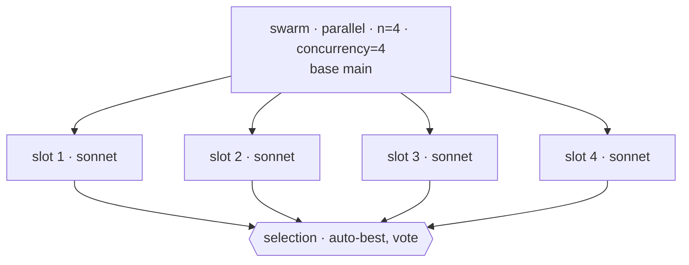
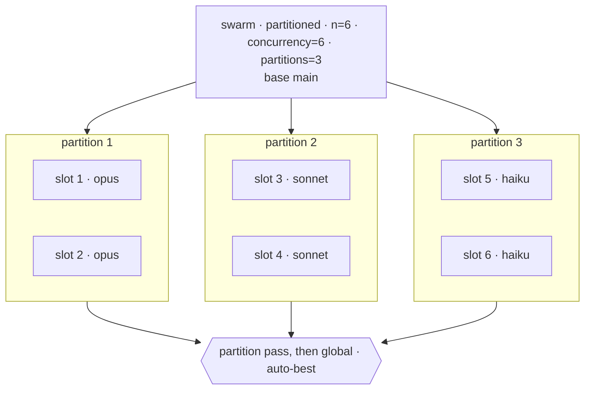
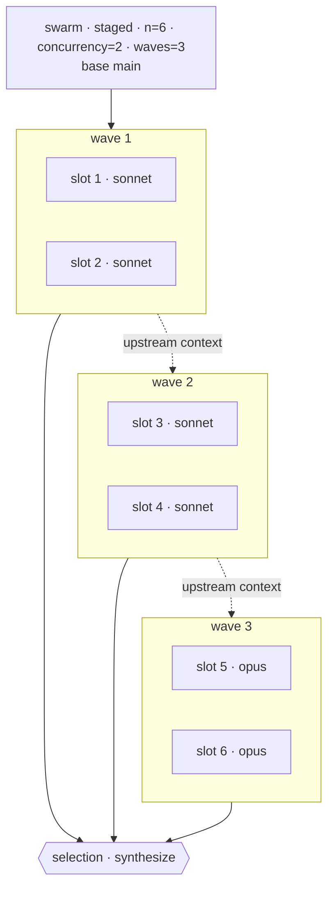
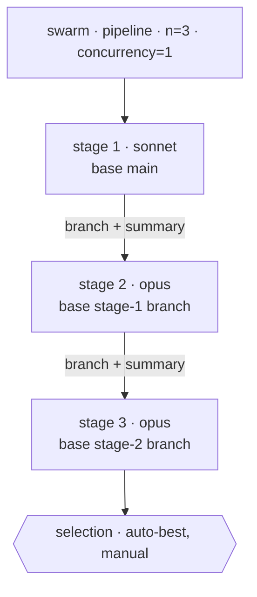

# Agent Swarm

## Task

Decide whether a coding task warrants parallel agent fan-out, design the swarm (size, topology, concurrency, model mix, replacement policy, selection modes), settle that design with the user at the depth `{mode}` calls for, dispatch through `worktree-task`, watchdog for hangs, and aggregate the per-member outcomes by running every requested selection mode in parallel over the surviving members.

This skill is the policy layer above `.cursor/skills/worktree-task/SKILL.md`. It owns the swarm-vs-single decision, sizing, topology, model mix, interaction mode, replacement policy, watchdog, aggregation strategy, and structured event emission. It never re-implements worktree mechanics — those belong to `worktree-task`.

## Parameters

- `{num_agents}` (aliases: `{n}`, `{num}`) — total agents to spawn; required; integer `>= 2`. A "swarm" of `1` is a single agent; refuse and recommend a direct `worktree-task` invocation instead.
- `{topology}` — how the `{num_agents}` members are arranged: `parallel` (one wave of independent members), `partitioned` (groups that share a model slice and get their own selection pass), `staged` (sequential waves, each informed by the previous one), or `pipeline` (a chain of single-member stages, each forking from its predecessor's branch); optional, default: `parallel`. See the Topology Catalog for per-topology dispatch, validation, and selection rules.
- `{mode}` — how far the user is involved in settling the design: `default` (state the plan in text and dispatch), `preview` (also draw the topology), `interactive` (also take one go/no-go before dispatch), or `plan` (iterate on the design with the user until they verify it). Optional; resolved from context per Interaction Modes, falling back to `default`. Distinct from the `{merge_mode} = interactive` this skill hands to `worktree-task`: that one governs the child's merge prompt, this one governs whether the swarm asks the user anything.
- `{preview_swarm_topology}` — how the topology is drawn when the resolved `{mode}` draws it: `mermaid` (default — one fenced ` ```mermaid ` block), `ascii`, or `both`. Format only; `{mode}` alone decides whether a diagram appears, so suppressing the visualization is `{mode} = default` rather than a value here. Naming it without naming `{mode}` resolves `{mode} = preview`, since asking for a format is asking for a drawing; naming it alongside `{mode} = default` is a validation error.
- `{max_iterations}` — hard cap on `plan` rounds; optional, default `10`, integer `>= 1`. Naming it without naming `{mode}` resolves `{mode} = plan`, since asking for a round cap is asking for the loop; naming it alongside any other mode is a validation error. Reaching the cap halts with `plan-cap-hit` and dispatches nothing.
- `{parallel_agents}` (aliases: `{p}`, `{parallel}`) — concurrency cap on members running simultaneously; optional, default: `{num_agents}` (full parallelism). MUST be an integer in `1..{num_agents}`. Maps to worktree-task's `{concurrency}` at dispatch; the total member count `{num_agents}` maps to its `{parallelism}`. Under `{topology} = staged` the cap applies within a wave; under `{topology} = pipeline` it resolves to `1`, and an invocation that names it with a value above `1` is a validation error.
- `{model_mix}` — model-assignment shape: `broadcast` (one model to all), `per-agent` (list of length `{num_agents}`), or `per-partition` (list of length `{num_partitions}` broadcast across contiguous slices); optional, default: `broadcast` with the parent agent's model.
- `{num_partitions}` — contiguous grouping of member slots, serving both per-partition model assignment and the `partitioned` / `staged` topologies from one value; optional with default `{num_agents}` when only `{model_mix} = per-partition` needs it, required with no default when `{topology}` is `partitioned` or `staged` (then MUST be an integer in `2..{num_agents}`). MUST divide `{num_agents}` evenly.
- `{selection_modes}` — list (any subset) of: `manual`, `auto-best`, `synthesize`, `vote`, `hybrid`, `tournament`, `consensus`. Every listed mode runs in parallel over the surviving members and produces its own outcome block; optional, default: `auto` (every mode whose prerequisites are met given the other parameters and whose rule the resolved `{topology}` supports; skipped modes are listed in the report with the missing prerequisite or the topology reason).
- `{test_command}` — shell verifier each member runs in its worktree; required when any of `auto-best`, `vote`, `hybrid`, `tournament` is in `{selection_modes}`.
- `{aggregator}` — prompt or shell command that produces a merged artifact from candidates; required when `synthesize` or `hybrid` is in `{selection_modes}`.
- `{min_successes}` — minimum members reaching `success` before aggregation runs; optional, default: `ceil({num_agents} / 2)`, or `1` under `{topology} = pipeline` where stages are cumulative rather than independent. If unmet after replacements terminate, every selection mode reports `under-floor` and no winner is auto-selected.
- `{relaunch_on_hang_after}` — wall-clock duration after which a silent member is force-aborted; optional, default: `5m`. Replacement happens per `{replacement_policy}`.
- `{replacement_policy}` — `off` | `replace-up-to-n` | `replace-up-to-budget`; optional, default: `off`. Controls whether killed members are respawned; replacements never recurse.
- `{cost_cap}` — soft cap on projected token spend or wall-clock seconds across the swarm; optional. When set, the workflow projects cost before dispatch; if projected exceeds the cap, the skill proposes a smaller `{num_agents}` and waits for user approval (does NOT silently shrink).
- `{pattern}` — optional preset shortcut; one of: `sanity`, `diversity`, `consensus`, `synthesize`, `tournament`, `refine`. When set, the preset supplies defaults for `{num_agents}`, `{topology}`, `{model_mix}`, and `{selection_modes}` from the Pattern Catalog. User-set parameters always override preset defaults.

## Success Criteria

- [ ] Before any worktree is created, the response records the swarm-gate verdict, the trigger ID(s) that fired, and (when `{pattern}` is used) the preset chosen.
- [ ] Parameters are validated before dispatch: `{num_agents} >= 2`, `{parallel_agents} <= {num_agents}`, `{topology}` is one of the four catalog values, `{num_partitions}` is present and in `2..{num_agents}` when `{topology}` is `partitioned` or `staged`, `{model_mix}` shape matches `{num_agents}` / `{num_partitions}`, `{num_partitions}` divides `{num_agents}` evenly, and required parameters for each entry in `{selection_modes}` are present.
- [ ] The dispatch shape matches the resolved `{topology}`: one `worktree-task` invocation for `parallel` and `partitioned`, one per wave for `staged`, one per stage for `pipeline` with each stage forking from its predecessor's branch.
- [ ] Selection modes that the resolved `{topology}` cannot support report `skipped: <reason>` in the Aggregation section instead of running.
- [ ] The resolved `{mode}`, its source, and — when context decided it — the cue that fired are recorded in the Swarm Plan before any worktree is created.
- [ ] The resolved `{mode}` gets the behavior its row in Interaction Modes specifies: `default` draws nothing and asks nothing, `preview` draws and dispatches, `interactive` draws and takes one go/no-go, `plan` iterates until the user verifies the design.
- [ ] Under `interactive` and `plan`, the plan the user answers for is the one that dispatches, and a decline or a `plan-cap-hit` creates no worktree at all.
- [ ] Worktree creation, branch naming, agent dispatch, and per-worktree diff capture are delegated to `worktree-task`; this skill emits no `git worktree` calls.
- [ ] When `{cost_cap}` is set, a cost projection is run before dispatch; if `projected > {cost_cap}`, the skill proposes a smaller `{num_agents}` and waits for user approval.
- [ ] When `{relaunch_on_hang_after}` expires for a member, that member is force-aborted; replacement happens iff `{replacement_policy}` allows; replacements never recurse.
- [ ] When `successes < {min_successes}` after the run terminates (including replacements), every selection mode reports `under-floor`; no winner is auto-selected.
- [ ] Every entry in the resolved `{selection_modes}` either runs over the surviving members or reports `skipped: <reason>`, and each produces its own outcome block in the Aggregation section.
- [ ] Structured JSON Lines events are emitted in the dedicated `### Events` section of every reply, in chronological order, covering the swarm-gate verdict, the resolved mode, any design the user settled, dispatch, member lifecycle, replacements, per-mode selection results, and run completion.
- [ ] At most one worktree branch is merged back per invocation, regardless of how many selection modes converged on the same winner.

## Guardrails

- MUST run the Swarm Gate before any side effect. At least one trigger MUST fire AND its identifier MUST appear in the response; otherwise abort and recommend a single agent.
- MUST compose with `worktree-task` for every worktree side effect (create, run, diff, merge prompt). MUST NOT re-specify or re-implement worktree mechanics.
- MUST validate parameters before dispatch; fail fast with no filesystem side effects on validation failure.
- MUST keep each member isolated to its assigned worktree; members MUST NOT read, write, or run commands against the calling worktree or any sibling worktree. Upstream context under `staged` / `pipeline` reaches a member as text in its task, never as filesystem access to another member's worktree.
- MUST NOT nest a topology: members never spawn members, so hierarchical, recursive, and dynamically-grown shapes stay out of the catalog. `staged` and `pipeline` order the swarm's own slots; they do not create new ones.
- MUST let `{mode}` alone decide whether the run pauses. Drawing the topology never pauses anything on its own — `preview` draws and dispatches — and no mode's pause stands in for the `{cost_cap}` projection.
- MUST NOT dispatch a plan the user has not seen under `interactive` and `plan`: every revision is re-rendered before it can be approved, and a decline or a `plan-cap-hit` ends the run with no worktree.
- MUST NOT ask anything under `default` or `preview` beyond the `{cost_cap}` approval, which belongs to the cost gate and fires in every mode. MUST NOT infer `interactive` or `plan` from a swarm being large, costly, or novel; only the cues in Interaction Modes resolve the mode.
- MUST treat `{relaunch_on_hang_after}` as a hard kill, not a polite request.
- MUST NOT chain replacements; a replaced member that itself hangs ends as `incomplete`.
- MUST NOT silently shrink `{num_agents}` to fit `{cost_cap}`; surface the proposed size and wait for the user's approval.
- MUST NOT recursively spawn swarms; every member runs as a single agent.
- MUST NOT merge more than one worktree branch per invocation, even when several selection modes converge on it.
- MUST emit events in chronological order in the dedicated `### Events` section of every reply, including the replies that pause for the user; MUST NOT inline events outside that section, and MUST NOT hold an event back for a later reply.
- Scope: orchestration policy (gate, sizing, topology, mix, interaction depth, dispatch shape, watchdog, aggregation, events). Out of scope: low-level worktree mechanics (delegated to `worktree-task`), pushing branches, opening PRs, cross-repo coordination, persistent scheduling.

## Swarm Gate

Run a swarm only when at least one trigger fires. Record the trigger ID(s) in the Swarm Decision section.

| ID | Trigger | When it fires |
|---|---|---|
| T1 | Multiple plausible approaches | Two or more designs are reasonable; the right one is non-obvious without trying both |
| T2 | High cost of being wrong | Irreversible changes, security-sensitive logic, public API design, expensive-to-detect failures |
| T3 | Open prompt or design space | Spec is loose; agents will reasonably interpret it differently and that variance is informative |
| T4 | Independent exploration adds signal | Disagreement detection, model-variance smoothing, or refactor-consensus is itself the goal |
| T5 | Cross-model comparison is the question | "Does Opus beat Sonnet on this task class?" or similar head-to-head |
| T6 | User explicitly requested fan-out | The user said "swarm", "best of N", "fan out", "parallel agents", or named the agent-swarm skill |

Counter-triggers (skip the swarm even if a trigger fires):

- Mechanically-correct task with one obvious shape (rename, format, scripted refactor).
- Token budget is the binding constraint and a single agent's quality is already adequate.
- The work depends on serial conversational context (interactive debugging, iterative log reading).

## Interaction Modes

The gate decides whether to swarm; `{mode}` decides how much of the design the user sees and settles before it dispatches. Every mode states the plan in text — the Swarm Plan section is never optional. Three things in this skill are spelled "mode" and none of them overlap: `{mode}` here, `{selection_modes}` for reducing candidates to an outcome, and the `{merge_mode}` handed to `worktree-task`.

| Mode | Draws the topology | Pauses | Use for |
|---|---|---|---|
| `default` | no | no | A settled request. The text plan is the whole story and the swarm runs. |
| `preview` | yes | no | A run the caller wants on the record. The diagram lands in the report and the swarm runs anyway. |
| `interactive` | yes | one go/no-go before the first worktree | A user in the loop who wants to see the shape before paying for it. |
| `plan` | yes, once per round | every round, until the design is verified, declined, or out of rounds | Designing the swarm itself, when the shape is the open question. |

### Resolving the mode

An invocation that names `{mode}` wins outright; an unknown value is rejected there and then, before anything else resolves. Otherwise walk these cues in order and take the first that matches:

| Cue | Resolved `{mode}` |
|---|---|
| The user asks to design, plan, or think through the swarm's shape, asks what shape it should be, or says not to run it yet | `plan` |
| The user asks to approve, confirm, or check the swarm before it runs | `interactive` |
| The user asks to see, show, or record the shape, without asking to approve it | `preview` |
| The invocation names `{max_iterations}` | `plan` |
| The invocation names `{preview_swarm_topology}` | `preview` |
| Nothing above matches — the request is settled, another agent dispatches it, or no user is in the loop | `default` |

What the user asked for outranks what they parameterized, which is why the two knob rows sit below the three intent rows: `{preview_swarm_topology}` names a format for a drawing the user may have asked to iterate on. A named knob still narrows the field, though — skip any intent row whose mode would ignore a knob the invocation named, so "show me the shape first" with `{max_iterations}` set lands on `plan` rather than colliding with the pairing rule. Only an invocation that names `{mode}` itself can strand a knob, and that collision is a validation error.

A knob row changes how much of the design the user sees, never whether the swarm would have run: a settled request that also names a format draws its shape and dispatches, exactly as `default` would have. A user merely being present is not a cue either — an ordinary "run a swarm on X" from a person is a settled request and resolves to `default`.

Record the resolved value and its source: `invocation` when `{mode}` was named, `parameter` when a knob row decided it, `context` when an intent row did, naming the row in the latter two cases. An ambiguous context is not a reason to ask; it resolves to `default`.

### The `plan` loop

`plan` is the one mode that owns resolution rather than inheriting it, because the parameters are what the user came to settle. A round is:

1. Re-run steps 3 through 6 of the Workflow so the pattern, the selection modes, the validation, and the cost projection all follow the current design. Any default derived from a value the revision changed is re-derived rather than carried over: `{parallel_agents}` does not stay at `6` because `{num_agents}` used to be `6`. A proposal the user has not overridden does carry forward as the current value, still labeled a proposal.
2. Render the topology per Topology Preview.
3. Report the design in the Output Format's pre-dispatch sections, ending with `### Plan Revision`: what changed since the previous round, and the open decisions worth the user's attention.
4. Take the user's answer, and check verification before the cap. A revision opens the next round. Verification ends the loop and dispatches the design exactly as last rendered. A decline ends the run.

Two rules keep the loop usable for a design that is not finished yet:

- **Unnamed shape parameters become proposals.** Under `plan`, every shape parameter the invocation did not name — `{num_agents}`, `{topology}`, `{num_partitions}`, `{model_mix}`, `{parallel_agents}` — is a proposal, whether the round took it from a documented default or drew it from the Sizing Heuristics, the Topology Catalog, and the Pattern Catalog. A default is the skill's suggestion, and `plan` exists to put those suggestions in front of the user rather than behind them; `{num_agents}`, which has no default at all, is proposed rather than failing validation for being absent. Nothing executable is ever proposed: `{test_command}` and `{aggregator}` stay unset until the user supplies them, and the selection modes that need them stay skipped. Everything outside that list keeps its ordinary default. Proposals are labeled as such in `### Plan Revision` and bind nothing until the user verifies the design.
- **A revision that fails validation costs a round, not the run.** Report the rule that failed in `### Plan Revision`, keep the last valid design on the table, restate its diagram without emitting a new preview event, and ask again. Only a failure in the invocation as it arrived — before round 1 renders anything — aborts outright.
- **A cost-cap question rides in the same round.** When the projection blocks the current design, its question goes in `### Plan Revision` ahead of the design question, and the round ends only once both are answered.

The loop ends in one of three terminal states, and only the first dispatches: `verified`, `declined`, or `plan-cap-hit`, which fires when a round ends unverified and the completed round count equals `{max_iterations}`. Rounds are numbered from `1`, a round that changes no parameter still counts, and `{max_iterations} = 1` therefore means one answerable round: the final round's `### Plan Revision` says so, because at the cap a revision and a decline reach the same place. No worktree exists until the loop ends in `verified`, so revisions cost only the rendering.

## Pattern Catalog

`{pattern}` is an optional shortcut that supplies defaults for `{num_agents}`, `{topology}`, `{model_mix}`, and `{selection_modes}`. User-set parameters always override the preset.

| Pattern | `{num_agents}` | `{topology}` | `{model_mix}` | `{selection_modes}` | When to use |
|---|---|---|---|---|---|
| `sanity` | 3 | `parallel` | `broadcast` | `[vote, manual]` | Cheap second-opinion check; surface obvious disagreement before committing |
| `diversity` | 6 | `parallel` | `per-partition` | `[manual, auto-best, synthesize]` | Open design space; want a comparable spread of styles |
| `consensus` | 5 | `parallel` | `broadcast` | `[vote, consensus]` | Verify a fragile fix is robust to seed and temperature noise |
| `synthesize` | 4 | `parallel` | `per-partition` | `[synthesize]` | Members explore complementary facets; merge into one artifact |
| `tournament` | 8 | `parallel` | `per-agent` | `[tournament, auto-best]` | Strong selection signal exists; want the best of several head-to-head |
| `refine` | 3 | `pipeline` | `broadcast` | `[auto-best, manual]` | One approach that rewards iteration; each stage sharpens the previous stage's branch |

## Sizing Heuristics

Pick `{num_agents}` from the lowest tier that still answers the trigger that fired.

| Tier | `{num_agents}` | Use for | Cost shape |
|---|---|---|---|
| Sanity | 2-3 | Disagreement detection, second opinion, A/B between two models | `~3×` single-agent cost |
| Diversity | 4-8 | Real best-of-N exploration; default range when a trigger fires | `~n×` cost; default range |
| Search | >8 | Only with `{cost_cap}` justification recorded in the response | Cost grows linearly; aggregation difficulty grows super-linearly |

Doubling the swarm rarely doubles the signal. Prefer raising selection rigor over raising `{num_agents}`.

## Topology Catalog

Sizing picks how many members run; `{topology}` picks how they are arranged — what each member forks from, which members run together, and what flows between them.

| Topology | Shape | Members fork from | Flow between members | Effective concurrency |
|---|---|---|---|---|
| `parallel` (default) | one wave of `{num_agents}` independent members | `{base_branch}` | none | `{parallel_agents}` |
| `partitioned` | `{num_partitions}` groups of `{num_agents} / {num_partitions}` members; the grouping drives model assignment, report layout, and a per-group selection pass rather than scheduling | `{base_branch}` | none across groups; each group gets its own selection pass before the global one | `{parallel_agents}`, shared across groups |
| `staged` | `{num_partitions}` sequential waves of `{num_agents} / {num_partitions}` members | `{base_branch}` | wave `j + 1` receives wave `j`'s member summaries as upstream context | `min({parallel_agents}, wave size)`; waves never overlap |
| `pipeline` | a chain of `{num_agents}` single-member stages | stage `1` from `{base_branch}`; stage `i` from stage `i - 1`'s branch | stage `i` receives stage `i - 1`'s summary and builds on its branch | `1` |

Slots keep the numbering `1..{num_agents}` in dispatch order under every topology. Group `g` and wave `g` both own the contiguous slice of `{num_agents} / {num_partitions}` slots starting at `((g - 1) × {num_agents} / {num_partitions}) + 1`; stage `i` is slot `i`.

`pipeline` and `staged` spend the same tokens as `parallel` for the same `{num_agents}`, but their wall clock scales with the number of stages or waves. Keep chains short (2-4 stages); reach for `staged` when a second look at the problem is worth more than a second independent attempt.

### Dispatch shape

Every topology resolves to one or more `worktree-task` invocations, and the skill still emits no worktree mechanics of its own.

| Topology | worktree-task invocations | Per-invocation parameters |
|---|---|---|
| `parallel` | 1 | `{parallelism} = {num_agents}`, `{concurrency} = {parallel_agents}` |
| `partitioned` | 1 | `{parallelism} = {num_agents}`, `{concurrency} = {parallel_agents}`; `{num_partitions}` is forwarded only when `{model_mix} = per-partition`, since the grouping otherwise serves the swarm's own reporting and selection |
| `staged` | one per wave, in wave order | `{parallelism} = {num_agents} / {num_partitions}`, `{concurrency} = min({parallel_agents}, wave size)`, `{base_branch}` unchanged, `{worktree_name} = <slug>-w<j>`; `{num_partitions}` is never forwarded, because each wave's slots already carry their resolved models |
| `pipeline` | one per stage, in stage order | `{parallelism} = 1`, `{concurrency} = 1`, `{base_branch}` = previous stage's branch, `{worktree_name} = <slug>-s<i>` |

A wave or stage launches only after the previous one terminates. Under `pipeline`, a stage that ends non-`success` stops the chain: the stages never launched are recorded as `incomplete` and selection runs over the stages that did complete. Under `staged`, a wave in which every member ends non-`success` stops the run the same way. `{relaunch_on_hang_after}` and `{replacement_policy}` apply per member and resolve before its wave or stage counts as terminated.

Branch names stay unique because every wave and stage carries its own `{worktree_name}`. Any `-<i>` suffix the child adds is local to that invocation, so a global slot in wave `j` lands on `<slug>-w<j>-<local index>`, and a single-member wave or stage keeps the bare name; the swarm's report and events keep the global slot number either way.

### Validation

- `{topology}` MUST be one of `parallel`, `partitioned`, `staged`, `pipeline`.
- `partitioned` and `staged` MUST carry an explicit `{num_partitions}` in `2..{num_agents}` that divides `{num_agents}` evenly.
- `pipeline` resolves `{parallel_agents}` to `1` when the invocation leaves it out; an invocation that names `{parallel_agents}` with a value above `1` is a validation error rather than a silent serialization. `staged` takes the same value without complaint: a cap wider than a wave simply never binds, the way `{parallel_agents} = {num_agents}` never binds under `parallel`, whereas a `pipeline` cap above `1` contradicts the topology itself.
- `{mode}` MUST be one of `default`, `preview`, `interactive`, `plan` — checked at resolution (Workflow step 2), before any event announces it — and `{preview_swarm_topology}` MUST be one of `mermaid`, `ascii`, `both`.
- A knob only one mode uses MUST NOT be named alongside a mode that ignores it: `{max_iterations}` outside `{mode} = plan`, or `{preview_swarm_topology}` alongside `{mode} = default`, is a validation error rather than a silently inert value. Naming either without naming `{mode}` resolves the mode instead (see Resolving the mode).
- `{max_iterations}` MUST be an integer `>= 1`.
- `{model_mix} = per-partition` and the `partitioned` / `staged` topologies share the one `{num_partitions}`; there is no second partition count to reconcile.
- A mode the topology skips does not carry its prerequisite: `{test_command}` and `{aggregator}` are required only for the modes that actually run.

### Selection compatibility

| Topology | Modes that run | Modes reported as `skipped` |
|---|---|---|
| `parallel` | every resolved mode, over the surviving members | — |
| `partitioned` | every resolved mode, once within each partition and then once globally over the partition outcomes | — |
| `staged` | every resolved mode, over the surviving members of every wave | — |
| `pipeline` | `manual` and `auto-best`, ranking stage branches with the deepest passing stage winning ties — that tie-break replaces the mode's diff-size one, because a later stage's branch contains every earlier stage | `synthesize`, `vote`, `hybrid`, `tournament`, `consensus` — `skipped: pipeline stages are cumulative, not independent candidates` |

`{min_successes}` stays a swarm-wide floor under every topology. A `partitioned` group with no survivors reports `under-floor` in its own partition block while the other groups still report their outcomes.

### Upstream context

Members in a `staged` wave after the first, and in every `pipeline` stage after the first, receive the verbatim `{task}` plus a delimited `## Upstream Context` block carrying the previous wave's or stage's per-member summaries, branch names, and test results. That block is text the swarm writes into the member's task; members still never read a sibling worktree. `parallel` and `partitioned` members receive the verbatim `{task}` and nothing else.

## Topology Preview

Every mode except `default` draws the resolved plan as a diagram, so the caller sees the shape before paying for it. The diagram reads resolved values only — slot count, per-slot model, group / wave / stage boundaries, base branches, and the resolved selection modes — so it renders after validation and after the cost projection settles, and before the first worktree. Under `plan` it renders once per round, always showing the design the current round is asking about.

- `{preview_swarm_topology}` picks the format. `mermaid` (default) emits one fenced ` ```mermaid ` block; `ascii` emits one fenced plain block; `both` emits the mermaid block followed by the ascii block. Both formats carry the same labels and obey the same rules below.
- The root node states the topology, `{num_agents}`, the concurrency actually in effect (the Topology Catalog's effective-concurrency column, so `min({parallel_agents}, wave size)` under `staged`), the grouping count when the topology has one, and `{base_branch}` when every member forks from it. Only `pipeline` puts a base branch on each node, because only there do they differ.
- Every slot node carries its own resolved model, which keeps a `per-agent` mix readable and gives the fold rule a uniform label to work on; group nodes carry only their own label. Under `plan`, every proposed value ends in `?` wherever it appears, field by field on the root node included, so the diagram says which numbers the user has yet to choose.
- When the unfolded diagram would draw more than 12 slot nodes, fold each run of identically-configured adjacent slots into one node (one line, in `ascii`) labeled with its slot range and count (`slots 3-12 · sonnet ×10`). A run never crosses a group, wave, or stage boundary. Runs of one never fold, so a `per-agent` mix or a swarm of single-member waves draws every slot: the threshold trims repetition rather than capping diagram size.
- When the `{cost_cap}` projection blocks the run, its approval settles first (Workflow step 6), so the diagram always shows the post-resize plan — the one that will actually dispatch — or is skipped entirely when the user declines the resize and nothing dispatches. The resize question and the mode's own question stay separate answers, because a resize approval is not approval of the shape. Under `plan`, the projection re-runs every round and asks again whenever the current design exceeds the cap at a size the user has not already approved.
- Skipped selection modes stay out of the diagram; the Aggregation section reports them.

Templates, one per topology, with resolved values substituted into the labels:

`parallel`, `{num_agents} = 4`:



`partitioned`, `{num_agents} = 6`, `{num_partitions} = 3`:



`staged`, `{num_agents} = 6`, `{num_partitions} = 3` waves:



`pipeline`, `{num_agents} = 3`:



The `ascii` format carries the same labels as an indented tree: the root line as above, joining with ` · ` the fields the mermaid root splits with `<br/>`; one line per group, wave, or stage, with one line per slot beneath it; and a trailing line naming the resolved selection modes. Under `parallel`, which has no grouping, the slot lines hang directly off the root. Where the topology carries something between groups — the upstream context a `staged` wave hands the next, the branch a `pipeline` stage hands its successor — one line names it at the boundary, as `↓ upstream context` does below.

```
swarm · staged · n=6 · concurrency=2 · waves=3 · base main
├── wave 1
│   ├── slot 1 · sonnet
│   └── slot 2 · sonnet
│   ↓ upstream context
├── wave 2
│   ├── slot 3 · sonnet
│   └── slot 4 · sonnet
│   ↓ upstream context
└── wave 3
    ├── slot 5 · opus
    └── slot 6 · opus
selection · synthesize
```

## Model-Mix Strategies

Three shapes, dispatched through `worktree-task`'s `{agent_model}` parameter:

- **`broadcast`** — one model identifier broadcast to every member. Variance from sampling alone. Default.
- **`per-agent`** — list of length `{num_agents}`, one model per slot positionally. Use for explicit head-to-head model comparison.
- **`per-partition`** — list of length `{num_partitions}`, broadcast across `{num_agents} / {num_partitions}` contiguous slots. Use for "k samples per model" comparisons.

Validation: list-by-agent length MUST equal `{num_agents}`; list-by-partition length MUST equal `{num_partitions}`, and `{num_partitions}` MUST divide `{num_agents}` evenly. Those lengths describe the caller's input. The swarm resolves it once into a per-slot assignment over the global slots `1..{num_agents}` — expanding a `per-partition` list across its slices — and then hands each `worktree-task` invocation the slots it owns: all `{num_agents}` of them under `parallel` and `partitioned`, the wave's slice under `staged`, the stage's single identifier under `pipeline`. Each invocation therefore receives a scalar when its slots share one model, or a list whose length equals that invocation's `{parallelism}`, which is exactly the child's check (see Workflow step 8). Expanding before dispatch keeps the child from having to choose between its two accepted list shapes.

## Selection Modes (run in parallel)

All modes listed in the resolved `{selection_modes}` run independently over the surviving members; each emits its own outcome block. Each mode is a read-only pass over the same data, so running several is cheap and gives the caller a side-by-side comparison.

| Mode | Decision rule | Requires |
|---|---|---|
| `manual` | Present per-member report; user picks zero or one branch | nothing extra |
| `auto-best` | Rank by `{test_command}` exit (0 wins); break ties on smaller diff, fewer files touched, lower-index slot | `{test_command}` |
| `synthesize` | Run `{aggregator}` over surviving members; emit one merged artifact (no branch is merged) | `{aggregator}` |
| `vote` | Group members by output equivalence (test result + structural diff hash); pick largest group; tie-break on lower-index | `{test_command}` or comparable signature |
| `hybrid` | Filter to members passing `{test_command}`, then run `{aggregator}` over the filtered subset (or fall back to manual pick if synthesis is inappropriate for the artifact type) | `{test_command}` AND `{aggregator}` |
| `tournament` | Pairwise comparisons reduce `2^k` members to `1`; requires comparison cost to be cheap relative to member cost | `{test_command}`; `{num_agents}` MUST be a power of 2 |
| `consensus` | Strict per-hunk overlap across members; emit only the agreed subset as a unified diff plus a list of contested hunks | comparable diffs |

When `{selection_modes} = auto` (the default), the skill includes every mode whose prerequisites are met and whose rule the resolved `{topology}` supports (see Selection compatibility). Skipped modes appear in the Aggregation section as `skipped: <missing prerequisite>` or `skipped: <topology reason>` so the omission is auditable.

## Replacement Policy

`{replacement_policy}` controls hang recovery. Replacements multiply spend, so opt-in is required.

- **`off`** (default) — killed members end as `incomplete`; no replacement is launched.
- **`replace-up-to-n`** — each slot may respawn at most once. Total replacement budget is `{num_agents}`. A replacement that itself hangs ends as `incomplete`.
- **`replace-up-to-budget`** — replacements continue while `{cost_cap}` projection still allows; pending replacements are cancelled when the cap is crossed. Requires `{cost_cap}` to be set.

A replacement counts toward `{min_successes}` only if the replacement itself reports `success`.

## Cost Cap and Projection

When `{cost_cap}` is set, the workflow runs a cost projection before dispatch:

```
projected = ({num_agents} + projected_replacements) × per_agent_estimate
```

If `projected > {cost_cap}`, propose the largest `{num_agents}` value that fits the cap and wait for user approval. NEVER silently shrink. Without `{cost_cap}`, no pre-launch gate runs and cost is reported only via emitted events and the post-run report.

Token spend follows `{num_agents}` under every topology. A wall-clock `{cost_cap}` MUST instead be projected against serial depth: `{num_agents}` stages under `pipeline`, `{num_partitions}` waves under `staged`, and `ceil({num_agents} / {parallel_agents})` batches under `parallel` and `partitioned`.

## Events

The skill emits structured events in a dedicated `### Events` section of the reply. Events are JSON Lines (one JSON object per line) so external tooling can grep the section and compute cost on the fly without re-parsing the markdown report. Schema:

```json
{ "ts": "2026-05-17T01:30:00Z", "type": "<event_type>", "payload": { ... } }
```

| Type | Payload fields | Emitted when |
|---|---|---|
| `swarm.gate_decided` | `verdict`, `triggers_fired`, `pattern` | After the Swarm Gate runs |
| `swarm.mode_resolved` | `mode`, `source` (`invocation` / `parameter` / `context`), `cue` (the row that fired, or `null` when the invocation named the mode) | After `{mode}` resolves and passes its enum check, before any other resolution |
| `swarm.topology_previewed` | `topology`, `format`, `slot_count` (of the drawn plan, which is the approved size when the cost gate resized the swarm), `round` (`plan` only; omitted in every other mode) | Once per drawn plan, so once per `plan` round. `both` emits one event rather than one per block, and a closing reply that restates an already-drawn diagram emits none |
| `swarm.design_settled` | `mode`, `rounds` (always `1` under `interactive`), `decision` (`approved` / `declined` under `interactive`; `verified` / `declined` / `plan-cap-hit` under `plan`) | When the user settles the design under `interactive` or `plan`, however it ends |
| `swarm.dispatched` | `num_agents`, `parallel_agents`, `topology`, `model_mix`, `selection_modes` | After `worktree-task` is launched |
| `swarm.stage_started` | `kind` (`wave` / `stage`), `index`, `slots` (the global slot range it owns), `base_branch` | Before each wave or stage launches under `staged` / `pipeline` |
| `member.started` | `slot`, `model`, `worktree_path` | When a member begins |
| `member.progress` | `slot`, `last_activity_ms` | Heartbeat (per `worktree-task`'s reporting cadence) |
| `member.completed` | `slot`, `status`, `test_exit`, `diff_lines` | When a member terminates (success / failed / incomplete) |
| `member.replaced` | `slot`, `reason`, `replacement_model` | When a hung member is killed and respawned |
| `selection.completed` | `mode`, `result`, `rationale` | Once per resolved entry in `{selection_modes}` |
| `swarm.done` | `successes`, `failures`, `replacements`, `wall_clock_s`, `floor_met`, `outcome` (`completed` / `declined` / `plan-cap-hit` / `validation-error`) | At end of run, including one that stopped before dispatch — every run past the gate emits exactly one, with zero counts and `floor_met=false` when no member ever started |

Events MUST appear in chronological order. Do NOT inline events outside the dedicated section. A run that spans several replies closes each one with its own `### Events` section carrying the events that fired since the previous reply, so no event is ever held back waiting for a reply that may never come.

## Workflow

1. **Swarm gate.** Walk the Swarm Gate table and any counter-triggers. If no trigger fires (or a counter-trigger applies), recommend a single agent and stop. Emit `swarm.gate_decided`.
2. **Resolve `{mode}`.** Take the invocation's value, rejecting an unknown one here rather than three steps later, or walk the Interaction Modes cues and fall back to `default`. Emit `swarm.mode_resolved`.
3. **Apply pattern (if `{pattern}` is set).** Populate defaults for `{num_agents}`, `{topology}`, `{model_mix}`, and `{selection_modes}` from the Pattern Catalog row. User-set parameters override.
4. **Resolve `{selection_modes}`.** When the value is `auto`, include every mode whose prerequisites are met given the other parameters and whose rule the resolved `{topology}` supports. Every catalog mode outside the resolved list is a skipped mode: record each one with its reason (the missing prerequisite, or the topology rule that excludes it) so the Aggregation section can report it.
5. **Validate parameters.** Confirm sizing, topology (catalog value, partition count where required, `{parallel_agents}` under `pipeline`), the `{preview_swarm_topology}` value, `{max_iterations}` as an integer `>= 1`, the pairing rule that keeps a mode-specific knob out of a mode that ignores it, mix shape, partition divisibility, and selection-mode prerequisites. `{mode}` itself was already checked in step 2. Fail fast on any mismatch (no filesystem side effects), rendering `### Validation Error` and closing with `swarm.done` at `outcome=validation-error`, except inside a `plan` round, where a failed revision costs a round instead of the run.
6. **Cost projection (when `{cost_cap}` is set).** Compute projected cost against `{num_agents}` for tokens and against the topology's serial depth for wall clock. If `projected > {cost_cap}`, propose the largest `{num_agents}` that fits and wait for user approval.
7. **Draw and settle the design, per the resolved `{mode}`.** `default` skips this step entirely. Otherwise render the plan step 6 settled on into the `### Topology Preview` section and emit `swarm.topology_previewed`. Then: `preview` continues to dispatch; `interactive` takes one go/no-go and emits `swarm.design_settled`; `plan` runs the loop from Interaction Modes, re-entering steps 3 through 6 before each new round renders, so the pattern, selection modes, validation, and cost projection all track the current design, and emitting `swarm.design_settled` with the round count when it ends. A `declined` or `plan-cap-hit` outcome stops here with no worktree and no `swarm.dispatched`: the closing reply restates the last rendered diagram without drawing a new one, and closes with `swarm.done` carrying that outcome, zero counts, and `floor_met=false`.
8. **Dispatch via `worktree-task`.** Follow the Dispatch shape table for the resolved `{topology}`: one invocation for `parallel` and `partitioned`, one per wave for `staged`, one per stage for `pipeline`. Every invocation carries the slice of the resolved `{agent_model}` assignment belonging to its slots, the `{task}` (verbatim, plus the `## Upstream Context` block for `staged` waves and `pipeline` stages after the first), `{test_command}` (when set), and `{merge_mode} = interactive`. Emit `swarm.dispatched` once for the plan and `swarm.stage_started` before each wave or stage. Do not re-implement worktree mechanics.
9. **Watchdog.** Track each member's last activity. Emit `member.started`, `member.progress`, `member.completed` events as they fire. When `{relaunch_on_hang_after}` expires for a member, force-abort it; respawn per `{replacement_policy}` and emit `member.replaced`. Under `staged` and `pipeline`, the next wave or stage waits for the current one to terminate, replacements included.
10. **Floor check.** When all live members terminate, count `success`. If below `{min_successes}`, every selection mode reports `under-floor`; skip aggregation and emit `swarm.done` with `floor_met=false`.
11. **Run all resolved selection modes in parallel.** For each entry in the resolved `{selection_modes}`, apply its rule over the surviving members and emit `selection.completed`. Under `partitioned`, run each mode within every partition first, then globally over the partition outcomes. Each mode produces its own outcome block.
12. **Report and merge handoff.** Emit `swarm.done` at `outcome=completed`, then render the Output Format with that event last in its `### Events` section. Hand the chosen branch (if any) back through `worktree-task`'s merge prompt. At most one branch is merged per invocation, even if several modes converge on it.

## Output Format

Reply with the following named sections, in this order. Omit sections whose body is legitimately empty.

A mode that pauses splits the report across replies. Each reply that asks the user something carries the pre-dispatch sections — through `### Topology Preview` under `interactive`, through `### Plan Revision` under `plan` — and then its own `### Events` section; the reply that follows the user's answer resumes the order. Every reply carries an `### Events` section holding whatever fired since the previous one, in its usual place in the order, so a paused or abandoned run never strands an event.

A run that stops before dispatch — `declined`, `plan-cap-hit`, or a validation failure — closes with the pre-dispatch sections it reached plus `### Events`, and renders none of `### Per-Member Report`, `### Aggregation`, `### Recommendation`, or `### Handoff`, which all describe a run that happened.

### Swarm Decision

- `Verdict`: `swarm` or `single-agent`.
- `Triggers fired`: `T1`-`T6` IDs.
- `Pattern`: preset name or `none`.
- `Rationale`: one sentence tying verdict to triggers.

If `Verdict = single-agent`, stop here.

### Validation Error

Present this section when validation fails before dispatch, in place of `### Swarm Plan` and everything after it except `### Events`, which still closes the reply. Name the rule that failed, the values that violated it, and the smallest change that would satisfy it. No worktree exists, so there is nothing to clean up. A `plan` round that fails validation reports it under `### Plan Revision` instead and asks again.

### Swarm Plan

- `mode`: resolved value and its source, plus the cue that fired when context decided it. Add the round number and `{max_iterations}` under `plan`.
- `num_agents` / `parallel_agents`: e.g., `8 (parallel: 4)`.
- `topology`: value plus the resolved layout — partitions, waves, or stages with their base branches.
- `model_mix`: shape and resolved per-slot assignment.
- `selection_modes`: resolved list; skipped modes with reasons.
- `min_successes`: floor.
- `relaunch_on_hang_after`: duration.
- `replacement_policy`: value.
- `cost_cap`: value or `unset`. Include the projection (and any user-approved downsize) when set.

### Topology Preview

Present this section whenever the resolved `{mode}` draws the topology — every mode except `default` — and render it before dispatch. One fenced ` ```mermaid ` block by default, a fenced plain block for `ascii`, or both for `both`, following the templates in the Topology Preview section. Under `interactive`, the go/no-go question follows this section in the same reply, ahead of `### Events`.

### Plan Revision

Present this section only under `{mode} = plan`, once per round, after the diagram:

- `Round`: `<n>` of `{max_iterations}`.
- `Changed`: what moved since the previous round, or `initial design` on round 1. Name any value the round proposed rather than took from the invocation, and any revision that failed validation, with the rule it broke.
- `Open decisions`: the design choices worth the user's attention now, each with the parameter it would change.
- `Next`: ask the user to verify the design as drawn, revise it, or stop — verifying dispatches it, stopping ends the run as `declined`. On the final round, say that revising instead of verifying ends the run as `plan-cap-hit`.

### Per-Member Report

Defer to `worktree-task`'s Worktree Results section verbatim; do not duplicate the schema. Group the member blocks by partition, wave, or stage when the resolved `{topology}` is not `parallel`.

### Aggregation

One block per resolved entry in `{selection_modes}`, in the order listed:

#### `<mode>`

- `Outcome`: chosen branch, synthesized artifact path, `under-floor`, `no-consensus`, or `skipped: <reason>`. Under `partitioned`, list the per-partition outcomes first, then the global one.
- `Rationale`: one line tying the outcome to the mode's rule.

### Events

Fenced JSON Lines block in chronological order:

```jsonl
{"ts": "...", "type": "swarm.gate_decided", "payload": {...}}
{"ts": "...", "type": "swarm.mode_resolved", "payload": {...}}
{"ts": "...", "type": "swarm.dispatched", "payload": {...}}
...
{"ts": "...", "type": "swarm.done", "payload": {...}}
```

### Recommendation

- `Action`: one of `merge <branch>`, `apply synthesized artifact`, `await user pick`, `retry single-agent`, or `widen swarm`.
- `Mode convergence`: which selection modes agreed on which outcome (e.g., `auto-best and vote both pick member 3; synthesize emitted a separate artifact; manual defers`).
- `Confidence`: `high` / `medium` / `low` with a one-line reason.

### Handoff

- `Merge`: hand the chosen branch (if any) back to `worktree-task`'s merge prompt; do not merge inline.
- `Cleanup`: ask the user which non-winning worktrees to delete; leave them in place by default.
