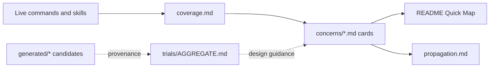

# Deep critique of the AI-coding Parameter Wiki

Review metadata:

- Run ID: `bc-019f5751-2cb7-7f7f-8bdf-3053f410b732`
- Model ID: `gpt-5.6-sol-medium`
- Reviewed revision: `9560abb71d959b8fbf7e0dbe219523f73bfa5e9b`
- Review scope: `ai-coding/parameters/`, checked against the live sources in
  `ai-coding/commands/` and `ai-coding/skills/`
- Review date: 2026-07-12

## Executive assessment

The Parameter Wiki has a sound central idea: organize the live parameter
surface by semantic concern, distinguish canonical concepts from artifact
spellings, and keep exploratory ontologies as non-normative provenance. Its
best pages, especially `concerns/replication.md` and `propagation.md`, make
otherwise hidden cross-artifact contracts substantially easier to reason
about.

The wiki is not yet reliable as the canonical reference it claims to be,
however. The most serious problem is not editorial: comparison with the live
skills exposes an unsatisfied dispatch contract between `agent-swarm` and
`worktree-task`. The wiki describes `{num_agents}` as total count and
`{parallel_agents}` as a concurrency cap, but the dispatch passes only
`parallel_agents` to a child parameter that controls both count and
concurrency. A request for eight agents with concurrency four therefore has no
documented mechanism that launches all eight. Per-agent model lists also have
incompatible required lengths across that boundary.

The other major weaknesses are completeness and enforceability. The wiki says
it covers every declared parameter, yet omits the parameterized
`trajectory-snapshot` skill. Its facts are repeated manually across cards, the
Quick Map, coverage, and propagation pages, with no drift check. The large
generated archive contains pervasive references to a removed
`worktree-task-agent` command and contradicts the normative alias mapping in
places. These defects make the distinction between “canonical” and
“well-intentioned prose” important.

Overall verdict: strong information architecture, useful semantic analysis,
but not yet a trustworthy contract or registry.

## What exists and how it fits together

The section has four effective layers:

1. `README.md` is the router. It defines conventions, a Quick Map, and the
   normative/provenance boundary.
2. `concerns/*.md` is the intended source of canonical semantic cards.
3. `coverage.md` and `propagation.md` are indexes and cross-scope views.
4. `generated/` and `trials/AGGREGATE.md` preserve ontology experiments and
   rationale.

The direction is sensible:



The intended operating rule is also good: cards own facts, indexes route to
facts, and generated documents preserve provenance. The current implementation
does not fully maintain that rule because facts such as aliases, defaults,
validation, and “used by” lists are copied into several manually edited pages.

## Strengths

### 1. The normative boundary is explicit

`parameters/README.md:17-20` clearly says that `generated/` and
`trials/AGGREGATE.md` are provenance rather than normative. This is necessary
because the archive contains mutually incompatible proposals. Preserving those
proposals instead of silently choosing one also retains useful design history.

### 2. Concern-first navigation matches author questions

The concern split generally maps to practical decisions: intent, I/O,
constraints, replication, models, selection, isolation, lifecycle,
robustness, interaction, and composition. An author deciding how many agents
to launch can read replication without first knowing which command happened to
introduce each spelling.

The artifact-to-concept direction remains available in `coverage.md`, so the
design supports both common lookup directions.

### 3. The replication trio is a valuable semantic decomposition

`concerns/replication.md:3-7` correctly distinguishes total candidate count,
active concurrency, and partition grouping. This is the highest-value piece of
the wiki because names such as `parallelism`, `parallel`, `n`, and
`num_partitions` otherwise encourage accidental conflation.

The page also honestly records that `worktree-task`'s `parallelism` controls
both count and concurrency (`concerns/replication.md:36-40`). That observation
is correct and, importantly, exposes the critical composition defect discussed
below.

### 4. Overloaded names are treated as contextual, not globally synonymous

`concerns/interaction.md` separates three meanings of `mode`: approval cadence,
authoring motion, and the unrelated save-session-state write mode. Similarly,
`concerns/models.md:3-7` distinguishes the current analysis model from models
assigned to spawned workers. These distinctions prevent a simplistic global
alias table from becoming actively misleading.

### 5. Validation and propagation are treated as first-class semantics

Cards include type, default, cross-parameter validation, propagation, and
usage. `propagation.md:13-26` supplies a compact vocabulary for broadcast, zip,
partition, rewrite, orthogonal, and bubble behavior. That is much more useful
than a parameter-name inventory alone.

### 6. The wiki acknowledges future mechanization

`future.md:62-73` identifies structured card data, alias statuses, generated
indexes, and recipes/traces as follow-ups. Those are the right directions. The
trial aggregate also warns that derived indexes can diverge
(`trials/AGGREGATE.md:187-193`), accurately predicting a failure already
visible in the live wiki.

## Findings

### Critical — the swarm count/concurrency contract cannot be implemented as documented

The live contracts are incompatible:

- `agent-swarm/SKILL.md:17-18` defines `{num_agents}` as total agents and
  `{parallel_agents}` as a cap in `1..num_agents`.
- Its only dispatch instruction, at `agent-swarm/SKILL.md:173`, invokes
  `worktree-task` with `{parallelism} = {parallel_agents}`.
- `worktree-task/SKILL.md:21,27,48` defines `{parallelism}` as both the number
  of worktrees created and the number run concurrently.

There is no queue, wave, or repeated-dispatch step that consumes
`num_agents - parallel_agents`. With `num_agents=8` and `parallel_agents=4`,
the documented workflow launches four worktrees, not eight.

The model contract fails in the same case:

- `agent-swarm/SKILL.md:19,104-107` permits a per-agent model list of length
  `num_agents`.
- `worktree-task/SKILL.md:20,26` requires that list length to equal
  `parallelism`.
- Dispatch sets `parallelism=parallel_agents`.

Thus an eight-element per-agent model list sent with concurrency four must fail
the child skill's validation.

The wiki repeats rather than resolves this contradiction:

- `concerns/replication.md:37-40` says the swarm “owns the total” but specifies
  no mechanism by which it launches the remainder.
- `propagation.md:54-56` maps the concurrency cap into count/concurrency while
  still describing model lists sized to `num_agents`.
- `propagation.md:39` says swarm members run as single agents, which does not
  explain the single `worktree-task` invocation creating a partial batch.

Impact: the core count and model-routing parameters are not composable for the
very case that makes a concurrency cap useful.

Recommendation: choose and document one implementable contract:

1. Add a separate concurrency parameter to `worktree-task`, keep
   `parallelism` as total count, and dispatch
   `parallelism=num_agents, concurrency=parallel_agents`; or
2. Have `agent-swarm` dispatch explicit waves of at most `parallel_agents`,
   slicing model assignments and maintaining globally stable member indexes.

The first option is simpler and gives count and concurrency consistent meanings
at both layers. Add contract tests for `n=p`, `n>p`, per-agent models, and
per-partition models.

### High — the “every parameter” coverage claim is false

`parameters/README.md:3-6` and `coverage.md:3-5` claim complete coverage of
parameters declared by commands and skills. The live
`skills/trajectory-snapshot/SKILL.md:13-20` declares:

- `{filename_format}`
- `{granularity}`
- `{coding_tool}`

`coverage.md` lists neither that skill nor those parameters. Its final section
accounts for four non-parameterized skills (`coverage.md:211-220`), leaving
`trajectory-snapshot` unclassified among the ten live skill files.

This is more than a missing row. The omitted skill has semantics the existing
concerns should expose:

- output path templating and collision handling;
- a four-value output granularity;
- coding-tool detection;
- rendered-output secret redaction;
- an explicit `native` mode exemption that preserves sensitive transcript
  bytes (`trajectory-snapshot/SKILL.md:19,30-31,38-39`).

Impact: readers trusting the coverage claim miss both an active parameter
surface and an important security boundary.

Recommendation: add the skill to `coverage.md`, map filename and output
behavior into I/O, map granularity/tool selection appropriately, and document
the redaction/native-copy distinction in a central security note. Until a
coverage check exists, soften “every” to “intended to cover every.”

### High — canonical facts have no mechanically enforced source of truth

The same facts are manually repeated in:

- `README.md` Quick Map;
- `concerns/*.md` card fields;
- `coverage.md`;
- `propagation.md`;
- source command/skill prose.

No tests, schema, generator, or validation target checks these views. This
explains how `trajectory-snapshot` was omitted and allows subtler errors such
as a default changing in a skill while remaining stale in a card.

The problem is structural, not solved by a one-time correction. The current
card template is markdown prose (`README.md:39-51`), so fields cannot be
reliably queried or checked without another heuristic parser.

Recommendation:

- Put stable IDs, aliases with artifact context, type, default, status, and
  `used_by` in machine-readable frontmatter or a registry.
- Generate the Quick Map and coverage tables.
- Validate source artifact names and links.
- Add a deliberately small drift check to the normal verification target.
- Keep explanatory meaning, gotchas, and rationale in prose beside the
  structured fields.

### High — the generated archive is stale enough to misdirect readers

The archive repeatedly describes a `worktree-task-agent` command and links to
paths that do not exist. The live artifact is
`skills/worktree-task/SKILL.md`. References occur throughout the major
generated perspectives, including `generated/concern/`,
`generated/flat/`, `generated/tree/`, `generated/stage-modular/`,
`generated/lifecycle/`, `generated/type-first/`, and
`generated/two-namespace/`.

There are also semantic conflicts. For example, generated documents treat `k`
as a candidate-count alias (`generated/tree/0-root.md:152` and
`generated/stage-modular/stage-replicate.md:13`), while the normative live
wiki correctly maps meta-prompt's `k` to concurrency
(`concerns/replication.md:28-35`).

The top-level normative page warns that generated content is provenance, but
individual generated subdirectory READMEs often read like active
specifications. A reader arriving through a direct link may never see the
warning.

Recommendation: preserve the archive unchanged for provenance, but add a
prominent generated-content banner to every generated entry page. The banner
should state the snapshot revision/date, identify renamed artifacts, and link
back to the normative wiki. A link checker should classify expected archival
breakage separately from live-reference failures.

### Medium — “card” granularity is inconsistent

Most cards represent one semantic value, but `write_gate` is explicitly a
family spanning:

- a five-state policy (`update_mode`);
- a two-state persistence location (`persistence`);
- a dry-run boolean;
- a write/preview mode.

These share a broad “can avoid writes” property but are not substitutable
parameters. `meta-prompt plan`, `persistence=chat`, and `dry_run=true` differ
in output, lifecycle, interaction, and whether work is performed at all.
Calling them one concept is useful for discovery but unsafe as a canonical
schema or rename target.

`artifact_path` has a similar, smaller issue: it groups generated prompt
destinations, design deliverables, and session-state snapshots with different
path bases, overwrite rules, and lifecycle semantics
(`concerns/io.md:24-36`).

Recommendation: distinguish a semantic family from an atomic parameter card.
Give each live contract its own stable card and make `write_gate` and
`artifact_path` family pages that route to those cards. Generators and rename
tools must operate on atomic cards, not families.

### Medium — important cross-parameter constraints are missing from cards

The `stop_condition` card describes ralph-design's allowed values but omits its
most important mode coupling. The live command requires
`user-signals-done` only with `mode=interactive`
(`commands/ralph-design.md:11-16,32`). Neither
`concerns/constraints.md:29-41` nor the `approval_mode` card in
`concerns/interaction.md:35-46` records that relationship.

This undercuts the stated purpose of cards as canonical validation references.
It also shows why validation constraints need structured, cross-card links
rather than isolated prose.

Recommendation: add the bidirectional constraint to both cards and represent
conditional validation in structured form once the registry exists.

### Medium — security is distributed and therefore easy to miss

The concern taxonomy has no security or data-handling route. Security-relevant
behavior currently appears only where an artifact happens to mention it. The
omitted trajectory skill is the clearest example: rendered snapshots redact
secrets, while native snapshots intentionally do not. Path handling, shell
commands, transcript paths, URLs, and overwrite behavior also cross concern
boundaries.

Recommendation: do not necessarily add a large “security ontology.” Add a thin
cross-cutting index for parameters that execute commands, fetch URLs, accept
paths, overwrite files, expose transcripts, or alter redaction. Link each row
to the owning atomic card and live source.

### Medium — discoverability is weak outside the section itself

The repository README does not mention the Parameter Wiki, and the sync script
only installs commands, skills, and rules (`scripts/sync:122-125,182-237`).
Searches across root author guidance and live command/skill entry points reveal
no link back to `parameters/README.md`.

Keeping the wiki repo-local may be intentional, but it means tool-home users
who consume synced skills are unlikely to discover the canonical naming and
validation guidance while authoring a new artifact.

Recommendation: link the wiki from the repository README and author guidance.
Document explicitly whether parameters are intentionally not synced. A sync
feature is optional; discoverability is not.

### Low — provenance metadata is incomplete

The generated index identifies source branches and one model, but individual
artifacts generally lack snapshot revision, generation date, status, and a
stable provenance pointer. The trial aggregate has a seed and trial count, but
the live cards do not state which recommendations were adopted or rejected.

Recommendation: add a concise provenance map rather than embedding more
history into every card.

### Low — selection and robustness remain artifact catalogs, not ontology

`concerns/selection.md` and `concerns/robustness.md` intentionally have no
cross-artifact cards because no exact parameter spans two artifacts. That is
consistent with the current card rule, but it limits the wiki's ability to
compare related policies such as failure floors, replacement budgets, retry
behavior, and reduction strategies.

Recommendation: retain artifact-specific atomic cards with `status=live` even
when used once. “Used by two artifacts” is a useful threshold for the Quick
Map, not a good threshold for whether a parameter deserves a stable identity.

## Architecture critique

The concern-first approach should remain the primary human navigation, but the
current directory structure conflates four jobs:

1. registry of live facts;
2. human explanations;
3. derived indexes;
4. historical design material.

The aggregate's proposed atlas/card/index/recipe/trace structure is directionally
right, but implementing the whole tree immediately risks creating a ninth
ontology, as its own risk section notes. A smaller evolution would deliver
most of the value:

```text
parameters/
  README.md
  registry.yaml              # atomic live contracts and stable IDs
  concerns/                  # human explanation and family routes
  coverage.md                # generated
  propagation.md             # generated matrix + authored explanations
  security.md                # thin cross-cutting route
  recipes/                   # only when repeated author tasks justify them
  generated/                 # immutable provenance, clearly bannered
  trials/                    # consolidation provenance
```

The registry should describe artifact-local truth rather than prematurely
forcing every spelling into one global type:

```yaml
- id: replication.concurrency.meta_prompt
  artifact: commands/meta-prompt.md
  surface: k
  family: replication.concurrency
  type: integer
  minimum: 1
  maximum_ref: replication.count.meta_prompt
  propagation: invocation_only
  status: live
```

Family pages can then explain that several atomic contracts are conceptually
related without claiming they are interchangeable.

## Prioritized action plan

1. Fix or redesign the `agent-swarm` → `worktree-task` count/concurrency
   dispatch contract and test `num_agents > parallel_agents`.
2. Add `trajectory-snapshot` to coverage and centralize its sensitive-output
   semantics.
3. Introduce stable atomic IDs and machine-readable metadata; generate the
   Quick Map and coverage index.
4. Add a validation task for missing artifacts, missing parameters, broken
   live links, alias collisions, defaults, and cross-parameter references.
5. Record the ralph-design mode/stop-condition constraint in both relevant
   cards.
6. Banner generated entry pages and distinguish archival broken links from
   live broken links.
7. Link the wiki from root author documentation and document its sync policy.
8. Add recipes and traces only after the registry and drift checks establish a
   trustworthy factual base.

## Suggested verification matrix

The minimum automated checks should cover:

| Check | Failure caught |
|---|---|
| Every command/skill with a declared parameter section appears in the registry | `trajectory-snapshot` omission |
| Every registry artifact path exists | stale renames |
| Every Quick Map and coverage row is generated from the registry | manual index drift |
| Defaults/types match structured declarations or reviewed source annotations | stale cards |
| Alias resolution includes artifact context | `k` count-vs-concurrency collision |
| Cross-parameter references resolve | missing or renamed constraints |
| Dispatch adapter tests satisfy parent and child cardinalities | swarm `n > p` defect |
| Live links pass; archival links are labeled | misleading generated docs |
| Sensitive-output modes carry a data-handling classification | native transcript exposure |

## Final judgment

The section has already done the difficult conceptual work of identifying
concerns, aliases, propagation modes, and the normative/provenance boundary.
Its strongest insight is that equal spellings are not necessarily equal
concepts and equal concepts may have many spellings.

Its next step should not be more prose. The immediate need is to correct the
swarm composition contract, close the demonstrable coverage gap, and make live
facts mechanically checkable. Once those are done, the existing concern pages
can become a dependable authoring interface rather than a manually synchronized
interpretation of the live artifacts.
