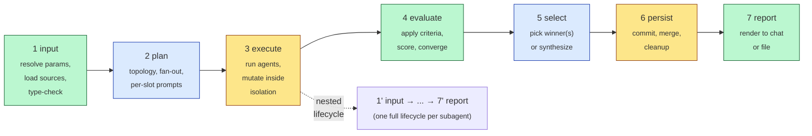

# Parameters — Lifecycle-First Ontology

## The angle

Group parameters by **where in the workflow they apply**. Every AI-coding command — analytical, generative, refactoring, fan-out, single-shot — runs the same canonical lifecycle:

> `input → plan → execute → evaluate → select → persist → report`

A parameter's home is the stage that **reads it first**; later stages either reference its resolved value or write derived values. Cross-cuts naturally — commands and skills consume *subsets* of these stages, not all seven. Single-shot commands run several stages degenerately; fan-out commands fully exercise every one.

## Motivation

- **Matches how parameters actually flow.** "Where is `save_path` read?" → input. "Where is it written?" → persist. Two questions, two stages, one parameter — no taxonomy gymnastics.
- **Cross-cuts commands and skills cleanly.** `conventional-commits` is a persist-stage skill; `minimal-diffs` is an execute-stage skill; `critique`-style commands exercise input → evaluate → report and skip persist; `worktree-task-agent` exercises all seven. The lifecycle exposes the contract each consumer signs up for.
- **Forces explicit thinking about side effects.** Plan / evaluate / select / report are read-only on the world. Execute mutates inside isolation. Persist mutates outside. The lifecycle makes accidental side-effects visible.
- **Surfaces the inner-vs-outer ambiguity** that recurs everywhere. The same parameter name (`task`, `parallel`, `criteria`, `save_path`) can mean different things at different nesting levels; the lifecycle gives a stable scaffold to resolve those collisions stage-by-stage. See [`inner-vs-outer.md`](inner-vs-outer.md).

## Lifecycle pipeline

**Stage classes:**

- **Read-only on world:** `input`, `evaluate`, `report` (green)
- **Pure decision (no I/O, no mutation):** `plan`, `select` (blue)
- **Mutating:** `execute` (inside isolation), `persist` (outside isolation) (amber)

If a command violates a stage's invariant (e.g. evaluate writes to the user's repo), the lifecycle says you've misnamed your stage.

## Files in this directory

| File                                       | Stage             | Parameter count* |
| ------------------------------------------ | ----------------- | ---------------- |
| [`1-input.md`](1-input.md)                | input             | 27               |
| [`2-plan.md`](2-plan.md)                  | plan              | 21               |
| [`3-execute.md`](3-execute.md)            | execute           | 2 (+ many consumed) |
| [`4-evaluate.md`](4-evaluate.md)          | evaluate          | 2 (+ many consumed) |
| [`5-select.md`](5-select.md)              | select            | 1 (+ many consumed) |
| [`6-persist.md`](6-persist.md)            | persist           | 3 (+ many consumed) |
| [`7-report.md`](7-report.md)              | report            | 2 (+ many consumed) |
| [`inner-vs-outer.md`](inner-vs-outer.md)  | (depth disambig)  | (cross-cuts all)  |

\* "Primary home" count — the parameter is defined and motivated in that file. Many parameters are referenced (consumed) by later files; the canonical home is where they're first read. **Total canonical parameters: 58.**

## Stages — at-a-glance parameter list

### 1. Input (27)

`file`, `directory`, `glob`, `url`, `inline`, `format`, `file_type`, `int_range`, `task`, `input`, `context`, `criteria`, `guardrails`, `stop_condition`, `save_path`, `output_format`, `compare_against`, `selection_mode`, `aggregator`, `ranker`, `auto_save_winner`, `merge_mode`, `merge_count`, `cleanup_policy`, `verbosity`, `require_diff`, `include_terminal_log`

### 2. Plan (21)

`parallel`, `n_candidates`, `num_partitions`, `depth`, `fan_out`, `subagent_type`, `subagent_prompt`, `subagent_model`, `subagent_constraints`, `focus_hints`, `seed`, `temperature`, `timeout`, `relaunch_on_hang_after`, `retry_policy`, `hang_policy`, `min_successes`, `isolation`, `worktree_name`, `worktree_root`, `base_branch`

### 3. Execute (2 primary)

`model`, `test_command`. Plus *consumers* of every plan / input parameter that drives the agent run.

### 4. Evaluate (2 primary)

`pass_predicate`, `severity_scale`. Plus consumers of `criteria`, `ranker`, `compare_against`, `min_successes`, etc.

### 5. Select (1 primary)

`tie_breaker`. Plus consumers of `selection_mode`, `ranker`, `aggregator`, `merge_count`, `merge_mode`.

### 6. Persist (3 primary)

`commit_message`, `merge_strategy`, `push_remote`. Plus consumers of `save_path`, `merge_mode`, `cleanup_policy`, etc.

### 7. Report (2 primary)

`report_template`, `report_destination`. Plus consumers of `verbosity`, `require_diff`, `include_terminal_log`, `output_format`, `severity_scale`.

## Multi-depth handling

Subagents run *their own* full lifecycle inside an outer command's `execute` stage. The same parameter name can mean different things at outer vs. inner depth:

- **Default rule:** for `Depth: both` parameters, inner inherits the resolved outer value.
- **Critical exceptions** (NOT inherited; default to `1` / unset):
   - `parallel`, `n_candidates`, `num_partitions`, `fan_out` — otherwise a `parallel=8` outer would default-fan-out to 64 leaves.
   - `save_path` — inner agents write inside their isolation boundary, not to the user's destination.
- **`depth`** is decremented per level (not inherited verbatim).
- **`focus_hints`** is distributed: outer holds the list, inner sees the scalar `focus_hints[i]`.

Full disambiguation table for every cross-depth parameter lives in [`inner-vs-outer.md`](inner-vs-outer.md).

---

## Worked example 1 — `critique.md` through the lifecycle

`critique.md` is a read-only analysis command. It exercises five of seven stages; persist is a no-op (read-only) and select is degenerate when used as a single-rubric synthesize.

Parameter trace:

| Parameter           | Resolved at | Used at                                   | Notes                                                                            |
| ------------------- | ----------- | ----------------------------------------- | -------------------------------------------------------------------------------- |
| `{context}`         | input       | execute (loaded), evaluate (judged)       | required, `source_ref`                                                           |
| `{criteria}`        | input       | evaluate (the yardstick)                  | default: `quality + determinism`                                                 |
| `{model}`           | input       | execute (each analysis run)              | default: parent agent's model                                                    |
| `{parallel}`        | input → plan | execute (concurrency)                    | `int_range[>= 1]`, default 1                                                     |
| `{num_experiments}` | input → plan | execute (slot count)                     | aliased `n_candidates`; default 1                                                |

Stage-by-stage:

1. **input** — resolve `{context}` (file / directory / inline / url), load `{criteria}` (or apply default), record `{model}` / `{parallel}` / `{num_experiments}`. Validate `int_range[>= 1]` on the integers.
2. **plan** — emit `{num_experiments}` slots, each with `subagent_prompt = "analyze {context} against {criteria}"`, `subagent_model = {model}`. Wall-clock width = `{parallel}`. `focus_hints` is unset (all slots identical).
3. **execute** — launch slots in waves of `{parallel}`. Each subagent runs its own degenerate lifecycle, emitting structured findings `{location, criterion, severity, evidence, rationale}`.
4. **evaluate** — aggregate findings across slots: merge identical findings (`(location, criterion)` key), produce `convergence_record` with agreement counts. Apply `pass_predicate` (`slot_status == success`).
5. **select** — `selection_mode` is effectively `synthesize` (one aggregated report from N runs). `aggregator` is the built-in merge logic. No user prompt — selection is automatic.
6. **persist** — **no-op.** Guardrail: "MUST NOT modify `{context}` or any other file." No `save_path` is consumed; no commit; no merge.
7. **report** — render the canonical critique skeleton (Summary → Findings by severity → Divergent Findings → Open Questions). `verbosity` controls per-finding detail; `convergence_record` splits convergent vs. divergent sections.

**Mapping check.** Every `critique.md` requirement maps to a stage:

- "report header restates the resolved `{context}` / `{criteria}` / `{model}` / `{num_experiments}` / `{parallel}`" → report stage consuming input-stage values.
- "Every finding cites a specific location in `{context}`" → evaluate stage produces, report renders.
- "When `{num_experiments} > 1`, the report distinguishes convergent findings from divergent" → evaluate produces `convergence_record`, report splits sections.
- "When `{context}` is ambiguous … the report names the gap explicitly in an Open Questions section" → any stage can flag, report aggregates.
- "MUST NOT modify `{context}` or any other file" → persist is a no-op, by design.

## Worked example 2 — `worktree-task-agent.md` through the lifecycle

`worktree-task-agent.md` is the canonical multi-stage command. It exercises every stage non-trivially.

Parameter trace:

| Parameter           | Resolved at | Used at                                                      | Notes                                                               |
| ------------------- | ----------- | ------------------------------------------------------------ | ------------------------------------------------------------------- |
| `{task}`            | input       | plan (per-slot prompt), execute (each agent), evaluate (stop_condition check) | required                                                            |
| `{base_branch}`     | input → plan | execute (worktree fork point), persist (merge target)       | default: current branch                                             |
| `{worktree_name}`   | input → plan | execute (worktree creation), persist (cleanup)             | default: derived from `{task}`; `-{i}` suffix when `parallelism > 1`|
| `{delete_worktree}` | input       | persist (cleanup gate)                                       | aliased `cleanup_policy`, default `true` (== `delete-merged-only`)  |
| `{merge_mode}`      | input       | select (gating), persist (applied)                          | `interactive` (default) or `auto`                                   |
| `{test_command}`    | input       | execute (run inside each worktree), evaluate (exit code)    | `slot_test_exit_code` flows into `pass_predicate`                  |
| `{agent_model}`     | input → plan | execute (per-slot model)                                    | scalar or length-`parallelism` list                                 |
| `{parallelism}`     | input → plan | execute (slot count, wall-clock width)                       | `int_range[>= 1]`, default 1; aliases `parallel`                  |
| `{num_partitions}`  | input → plan | execute (per-partition model grouping)                       | `int_range[>= 1]`, default 1                                       |
| `{stop_condition}`  | input       | execute (when to stop), evaluate (verified)                  | optional                                                            |

Stage-by-stage:

1. **input** — resolve every parameter. Validate `int_range[>= 1]` on `{parallelism}` / `{num_partitions}`. Cross-validate: if `{agent_model}` is a list, length must equal `{parallelism}`. (From the command's contract: "Parameters are validated before any worktree is created … Validation failure aborts with an explanatory error and no filesystem side effects.") Type-check `{worktree_name}` is kebab-safe.
2. **plan** — derive per-slot branch names (`{worktree_name}-{i}`), assign `subagent_model` (broadcast scalar `{agent_model}` or zip a list), set `isolation = worktree`, `worktree_root = ~/.cursor/worktrees/<id>` (or user override). No I/O yet.
3. **execute** — for each `i in 1..{parallelism}`: create branch + worktree off `{base_branch}`, launch agent with `{task}` (+ `{stop_condition}` when provided) in that worktree, run `{test_command}` inside that worktree after the agent reports done, capture `slot_status`, `slot_artifact = git diff {base_branch}..HEAD`, `slot_test_exit_code`.
4. **evaluate** — apply `pass_predicate`: `slot_status == success AND (test_exit_code is null OR test_exit_code == 0)` AND `{stop_condition}` satisfied. Tag each slot with a merge eligibility flag. `min_successes` default `1` — gate fails if no slot passed.
5. **select** — `{merge_mode} = interactive` → present the per-worktree report and ask user. `{merge_mode} = auto` → pick the lowest-index passing slot (`tie_breaker = lowest-index`); `merge_count = one` caps the selection set at 1.
6. **persist** — `persist_merge(selected_slot)`: `git merge --no-ff` (`merge_strategy = no-ff`) into `{base_branch}`. On conflict → abort, no persist. On success: `persist_cleanup(selected_slot)` removes worktree + deletes branch (because `{delete_worktree} = true` AND merge succeeded). Other slots' worktrees stay (unless user opted to delete in interactive mode). `push_remote = false` (default) → no push.
7. **report** — render Run Summary, per-Worktree Results (`slot_status`, `slot_artifact` diff per `require_diff`, `slot_test_exit_code`, merge recommendation), Merge Recommendation section (`selection_rationale`), interactive Merge Prompt fragment.

**Mapping check.**

- "Parameters are validated before any worktree is created" → input + plan; "no filesystem side effects" on failure → plan stays side-effect-free.
- "Exactly `{parallelism}` isolated worktrees are created from `{base_branch}`" → execute creates them per plan's slot definitions.
- "If `{test_command}` is provided, each agent runs it once inside its worktree and the captured exit code is reported per worktree" → execute runs, evaluate consumes the exit code.
- "In `interactive` merge mode, the user is explicitly asked which worktree branch (if any) to merge" → select with `merge_mode = interactive`.
- "In `auto` merge mode, at most one worktree branch is merged" → select with `merge_count = one`.
- "Merge the selected branch (if any) into `{base_branch}` with `git merge --no-ff`" → persist with `merge_strategy = no-ff`.
- "MUST keep each agent's task execution isolated to its assigned worktree" → execute respects `isolation = worktree`.
- "MUST NOT merge more than one worktree branch per invocation" → select / persist enforce `merge_count = one`.

## Skills through the lifecycle

The two existing skills map cleanly onto stages — additional evidence the ontology is real and not invented:

- **`minimal-diffs/SKILL.md`** — execute-stage skill. It shapes what each subagent *writes* during execute: "Default to the smallest change that satisfies the request." It has no opinion on input, plan, evaluate, select, persist, or report. The execute stage is its single home.
- **`conventional-commits/SKILL.md`** — persist-stage skill. It governs how `commit_message` is rendered when persist creates commits. It has no opinion on execute (the agent's diff shape) or report. Persist is its single home.

Future skills should declare their stage(s) up-front; cross-stage skills should declare each stage they participate in (read-in vs. written-out).
