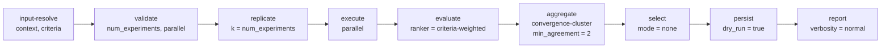

```mermaid
flowchart LR
  IR[input-resolve\ntask, stop_condition]
  V[validate\nparallelism, num_partitions, agent_model shape]
  I[isolate\nworktree x parallelism\nbase_branch, cleanup_policy]
  F[fan-out\nk = parallelism\nnum_partitions, agent_model]
  X[execute\nparallel = parallelism\ndispatch = partitioned]
  RC[recover\ntimeout, hang_policy\nretry_policy, min_successes]
  E[evaluate\nranker = test-exit-only]
  A[aggregate\nmean-score, min_successes]
  S[select\nmode = merge_mode\nmax_selected = 1]
  P[persist\nmerge_mode, no-ff\ncleanup_policy]
  RP[report\nverbose + diff]

  IR --> V --> I --> F --> X --> RC --> E --> A --> S --> P --> RP
```

# Parameter Ontology — Stage-Modular

## Angle and motivation

This ontology is structured by **stage**: a parameter has a home iff it is an input to (or an output of) exactly one of a small, reusable set of pipeline stages. Commands and skills are **compositions** of stages, and "multi-depth" parameter recurrence (e.g., `outer.k` vs. `inner.k`) is modeled as the *same stage instantiated at different depths*.

### Why stages

- **Composability.** A new command is a new stage sequence, not a new parameter dictionary. `worktree-task-agent.md` is `validate → isolate → fan-out → execute → recover → evaluate → aggregate → select → persist → report`. `critique.md` drops `isolate`, `fan-out` becomes `replicate`, and `persist` is `dry_run`. The parameter contracts of each stage are the same.
- **Clear contracts.** Every parameter is either a *required input*, an *optional input*, or an *output* of exactly one stage. Orphan parameters indicate a missing stage; redundant parameters indicate two stages that should be merged.
- **Depth as a first-class concept.** When a stage nests (fan-out inside fan-out, or evaluate inside evaluate), every parameter is qualified by depth (`fan-out[0].k`, `fan-out[1].k`). Inheritance and override rules are stated per stage, so the resolver can compute the effective value mechanically.
- **The cost is one extra abstraction layer.** Authors who only want to add one parameter to one command must now decide which stage owns it. See the self-critique at the bottom.

## The stages

| File | Stage | Purpose (one line) |
|---|---|---|
| [`stage-input-resolve.md`](stage-input-resolve.md) | `input-resolve` | Load raw refs (file / dir / glob / url / inline) into `resolved_task` + `resolved_context` + `resolved_criteria`. |
| [`stage-validate.md`](stage-validate.md) | `validate` | Type-check parameter shapes (int ranges, file types, list lengths) before any side effect. |
| [`stage-isolate.md`](stage-isolate.md) | `isolate` | Provision worktrees / sandbox dirs / branches for downstream `execute`s. |
| [`stage-replicate.md`](stage-replicate.md) | `replicate` | Produce `k` byte-identical job specs from a template (reliability / non-determinism studies). |
| [`stage-fan-out.md`](stage-fan-out.md) | `fan-out` | Produce `k` *diversified* job specs varying along model / seed / focus / partition (exploration / best-of-N). |
| [`stage-execute.md`](stage-execute.md) | `execute` | Run job specs — agent invocation, optional `test_command`, captured terminal log + diff. |
| [`stage-recover.md`](stage-recover.md) | `recover` | Wrap `execute` with `timeout`, `relaunch_on_hang_after`, `hang_policy`, `retry_policy`. |
| [`stage-evaluate.md`](stage-evaluate.md) | `evaluate` | Score / judge each execution against `criteria` (and optional `compare_against`). |
| [`stage-aggregate.md`](stage-aggregate.md) | `aggregate` | Reduce evaluations into convergent vs. divergent findings, vote tallies, `min_successes` gate. |
| [`stage-select.md`](stage-select.md) | `select` | Pick zero / one / many winners via `manual` / `auto-best` / `synthesize` / `none`. |
| [`stage-persist.md`](stage-persist.md) | `persist` | Write artifacts, merge worktrees into `base_branch`, run `cleanup_policy`. |
| [`stage-report.md`](stage-report.md) | `report` | Render the user-facing report drawing from every prior stage's outputs. |

### Stage I/O index (compact)

Inputs each stage owns appear in **bold**; outputs appear in *italics*. (Every parameter from the base inventory is reachable through this table; no orphans.)

- `input-resolve` ← **`input`**, **`task`**, **`context`**, **`criteria`**, **`format`**, **`file_type`**, **`glob`**, **`inline`**, **`url_timeout`**, **`max_bytes_per_artifact`** → *`resolved_task`*, *`resolved_context`*, *`resolved_criteria`*, *`loaded_artifacts`*, *`skipped`*, *`resolution_warnings`*
- `validate` ← **`validated_params`** (any prior params), **`schema`**, **`strict`**, **`cross_checks`** → *`validation_report`*, *`errors`*, *`warnings`*, normalized *`validated_params`*
- `isolate` ← **`isolation`**, **`base_branch`**, **`worktree_name`**, **`worktree_root`**, **`count`**, **`detached`**, **`repo_root`**, **`start_ref`**, **`cleanup_policy`** → *`isolations`*, *`isolation_warnings`*
- `replicate` ← **`template`**, **`k`** (a.k.a. `n_candidates`, `num_experiments`), **`parallel`**, **`isolations`** (ref), **`index_base`**, **`seed_strategy`** → *`jobs`*, *`replication_summary`*
- `fan-out` ← **`template`**, **`k`** (a.k.a. `fan_out`, `parallelism`), **`agent_model`**, **`num_partitions`**, **`focus_hints`**, **`seed`**, **`temperature`**, **`parallel`**, **`isolations`** (ref), **`index_base`** → *`jobs`*, *`partition_map`*, *`fan_out_summary`*
- `execute` ← **`jobs`**, per-job **`task`**, **`model`** (a.k.a. `agent_model`, `subagent_model`), **`subagent_type`**, **`subagent_prompt`**, **`subagent_constraints`**, **`context`**, **`guardrails`**, **`stop_condition`**, **`test_command`**, **`seed`**, **`temperature`**, **`isolation_id`**, **`working_directory`**; pipeline-level **`parallel`**, **`dispatch_strategy`** → *`executions`*, *`execute_summary`* (each `execution_result` carries `status`, `exit_code`, `terminal_log`, `diff`, `artifacts`, `summary`, `stop_condition_met`, `duration_ms`, `error`)
- `recover` ← **`execute_stage`** (ref), **`timeout`** (a.k.a. `relaunch_on_hang_after` at finer grain), **`hang_policy`**, **`retry_policy`**, **`cooldown_between_attempts`**, **`min_successes`** → *`executions`* (extended with `final_status`, `recovery_attempts`, `attempt_log`, `was_replaced`), *`recover_summary`*
- `evaluate` ← **`executions`**, **`criteria`**, **`ranker`**, **`judge_model`**, **`compare_against`**, **`severity_scale`**, **`pass_threshold`**, **`parallel`**, **`judge_prompt`**, **`evaluate_artifacts`** → *`evaluations`* (each carries `score`, `findings`, `pass`, `judge_log`), *`criterion_coverage`*, *`evaluate_summary`*
- `aggregate` ← **`evaluations`**, **`executions`**, **`aggregator`**, **`min_successes`**, **`convergence_key`**, **`min_agreement`**, **`compare_against`**, **`weighting`** → *`aggregate_report`* (incl. `met_threshold`), *`convergent_findings`*, *`divergent_findings`*, *`per_criterion_counts`*, *`aggregate_summary`*
- `select` ← **`executions`**, **`evaluations`**, **`aggregate_report`**, **`selection_mode`**, **`ranker`**, **`max_selected`** (a.k.a. `merge_count`), **`respect_threshold`**, **`tie_breaker`**, **`interactive_prompt_template`** → *`selected`*, *`rejected`*, *`selection_rationale`*, *`selection_summary`*
- `persist` ← **`selected`**, **`save_path`**, **`output_format`**, **`auto_save_winner`**, **`merge_mode`**, **`merge_count`**, **`merge_strategy`**, **`base_branch`**, **`cleanup_policy`**, **`delete_worktree`**, **`branch_naming`**, **`dry_run`** → *`persisted_paths`*, *`merged_branches`*, *`removed_worktrees`*, *`kept_worktrees`*, *`merge_failures`*, *`manifest`*
- `report` ← **`pipeline_state`** (ref), **`verbosity`**, **`require_diff`**, **`include_terminal_log`**, **`output_format`**, **`sections`**, **`redact`**, **`interactive_prompts`** → *`report`*, *`report_sections`*, *`next_actions`*, *`report_summary`*

## Composition rules

The composition is a directed graph; the canonical linear form is:

```
input-resolve → validate → isolate? → (replicate | fan-out) → execute (wrapped by recover?)
   → evaluate → aggregate → select → persist → report
```

Rules:

1. **Ordering.** `input-resolve` and `validate` MUST precede any stage with side effects. `report` MUST be terminal. Other stages are skippable when their parameters are at defaults / null.
2. **Pure vs. effectful.** Pure stages (`input-resolve`, `validate`, `replicate`, `fan-out`, `evaluate`, `aggregate`, `select`, `report`) MUST NOT touch the filesystem. Effectful stages (`isolate`, `execute`, `recover`-via-`execute`, `persist`) MUST honor their declared cleanup contract on failure.
3. **Type vocabulary.** `validate` is the single source of truth for parameter types (`int_range`, `file_type`, `list<T> | T`, `model_id`, `command`, `duration`, etc.). Other stages reference these types in their contracts but never redefine them.
4. **Depth.** A stage may be instantiated at multiple depths in a composition. Parameters are addressed as `<stage>[<depth>].<param>`. The default depth is `0`. Inheritance is declared per stage (see each stage's "Depth-Aware Aliasing" section); commonly inherited: `parallel` (cascades inward, divided by outer `k`), `model` (does NOT cascade), `criteria` (does NOT cascade), `cleanup_policy` (cascades but cannot escalate).
5. **Aliases.** The same scalar may legitimately appear under multiple names because different commands name it differently:
   - `k` ≡ `n_candidates` ≡ `num_experiments` ≡ `fan_out` ≡ `parallelism` (when concurrency = candidate count). The contract uses `k` canonically; aliases are accepted at the command level.
   - `model` ≡ `agent_model` ≡ `subagent_model`.
   - `max_selected` ≡ `merge_count`.
   - `timeout` ≡ `relaunch_on_hang_after` (hard vs. soft).
6. **Output → input wiring.** A downstream stage names its input by an explicit `ref` to an upstream output (e.g., `evaluate.executions: ref: execute[0].executions`). Pipelines SHOULD use the canonical wiring unless explicitly overriding.
7. **Skip semantics.** A stage with all required inputs absent / null is skipped; its outputs default to the empty / null sentinel; downstream stages MUST tolerate that sentinel without error.

## Worked example 1 — `critique.md` as a stage pipeline

```
critique.md
└── input-resolve[0]    : {context, criteria, format=md}
    └── validate[0]     : {num_experiments: int_range:>=1, parallel: int_range:>=1}
        └── replicate[0]: {template, k=num_experiments, parallel}
            └── execute[0]: {parallel, dispatch=eager}
                └── evaluate[0]: {criteria=resolved_criteria, ranker=criteria-weighted, severity_scale=critical-major-minor-nit}
                    └── aggregate[0]: {aggregator=convergence-cluster, min_agreement=2, min_successes=0}
                        └── select[0]: {selection_mode=none, max_selected=0}     # descriptive pipeline; no winner
                            └── persist[0]: {dry_run=true}                       # nothing to write
                                └── report[0]: {verbosity=normal, require_diff=false, sections=[header,summary,findings,divergent,open-questions]}
```

Mermaid form:



Parameter flow:

- `{context}` → `input-resolve.context` → *`resolved_context`* → consumed by `execute.context`.
- `{criteria}` → `input-resolve.criteria` → *`resolved_criteria`* → consumed by `evaluate.criteria`.
- `{num_experiments}` → `validate` → `replicate.k`.
- `{parallel}` → `validate` → forwarded to `replicate.parallel` then `execute.parallel`.
- `{model}` → `replicate.template.model` → consumed by `execute`.

## Worked example 2 — `worktree-task-agent.md` as a stage pipeline

```
worktree-task-agent.md
└── input-resolve[0]    : {task, stop_condition (inline)}
    └── validate[0]     : {parallelism, num_partitions, agent_model shape, base_branch, test_command}
        └── isolate[0]  : {isolation=worktree, base_branch, worktree_name, count=parallelism, cleanup_policy=remove-on-success}
            └── fan-out[0]: {k=parallelism, num_partitions, agent_model, isolations}
                └── execute[0]: {parallel=parallelism, dispatch_strategy=partitioned}
                    └── recover[0]: {timeout, relaunch_on_hang_after, hang_policy, retry_policy, min_successes}
                        └── evaluate[0]: {ranker=test-exit-only, pass_threshold=0}
                            └── aggregate[0]: {aggregator=mean-score, min_successes}
                                └── select[0]: {selection_mode=merge_mode (manual|auto), max_selected=1, respect_threshold=true}
                                    └── persist[0]: {merge_mode, merge_count=1, merge_strategy=no-ff, base_branch, cleanup_policy, delete_worktree}
                                        └── report[0]: {verbosity=verbose, require_diff=true, include_terminal_log=2000}
```

Mermaid form:



Parameter flow:

- `{task}` → `input-resolve.task` → *`resolved_task`* → broadcast into every `fan-out.template.task` → consumed by `execute`.
- `{parallelism}` → `validate` → `isolate.count` AND `fan-out.k` AND `execute.parallel`.
- `{num_partitions}` + `{agent_model}` → `fan-out` (shape resolved via the three-form rule).
- `{test_command}` → `validate` → per-job `execute.test_command` → consumed by `evaluate` as exit-code source.
- `{stop_condition}` → per-job `execute.stop_condition` → produces `execution_result.stop_condition_met`.
- `{base_branch}` → `isolate.base_branch` and `persist.base_branch`.
- `{worktree_name}` → `isolate.worktree_name` (suffixed `-{i}` when `count > 1`).
- `{merge_mode}` → `select.selection_mode` (`manual` ↔ `interactive`, `auto-best` ↔ `auto`) AND `persist.merge_mode`.
- `{delete_worktree}` → `persist.delete_worktree` (a fine-grained override of `cleanup_policy`).
- `{agent_model}` → `fan-out.agent_model` (shape rule: scalar / by-agent / by-partition).

### Multi-depth example: best-of-N prompt refinement (composes `meta-prompt` inside `worktree-task-agent`)

When `meta-prompt.md` is itself run via `worktree-task-agent.md` with `{parallelism} = N`, each outer slot independently runs a meta-prompt pipeline that may itself fan out for inner exploration:

```
outer:
  fan-out[0]: { k = N, focus_hints = [...], agent_model = list-by-agent }
  execute[0]:
    inner (per slot, depth 1):
      fan-out[1]: { k = M, seed = list }      # alternative phrasings per slot
      execute[1]: { parallel = 1 }            # inner concurrency floored to 1 by default cascade
      evaluate[1]: { ranker = pairwise, compare_against = baseline_prompt }
      select[1]: { selection_mode = auto-best, max_selected = 1 }
      → outer slot's "result" is the inner winner

  aggregate[0]: { aggregator = mean-score over slot inner-winners }
  select[0]: { selection_mode = manual, max_selected = 1 }
  persist[0]: { save_path = .cursor/commands/<kebab>.md, auto_save_winner = true }
```

Aliasing in effect:

- `fan-out[0].k = N` (outer candidates) vs. `fan-out[1].k = M` (inner phrasings); total work is `N × M`.
- `parallel` cascades: outer `parallel = N`, inner default `parallel = floor(N / N) = 1`.
- `agent_model` does NOT cascade; outer `fan-out[0].agent_model` is a list-by-agent, inner `fan-out[1]` defaults to its slot's resolved scalar.
- `cleanup_policy` cascades inward but cannot escalate: outer `remove-on-success` → inner inherits `remove-on-success` but cannot demand `remove-always`.

## Self-critique (vs. the other 7 angles)

Strengths of stage-modular:

- Parameters have an unambiguous home (the stage whose input contract names them); collisions become explicit aliases.
- Depth-aware aliasing falls out naturally from "the same stage appearing twice."
- Composition rules give a single, mechanical answer for "what runs before what" — useful for tooling.

Weaknesses:

- **Boundary disputes.** Some params (`min_successes`, `compare_against`, `seed`) reasonably belong to two stages; the ontology has to either duplicate them or pick a canonical home and route via `ref`. Both options add cognitive load relative to a flat dictionary.
- **Premature partitioning.** Commands that don't replicate, fan out, isolate, evaluate, aggregate, or select (e.g., a one-shot `meta-prompt` invocation) still pay the cost of "which stage owns this param?" before any benefit kicks in. A two-namespace or lifecycle-first ontology would be lighter for such cases.
- **Wiring verbosity.** Output → input wiring via explicit `ref` is precise but noisy. Tree-shaped or concern-first ontologies can implicitly share a context object instead, trading explicitness for ergonomics.
