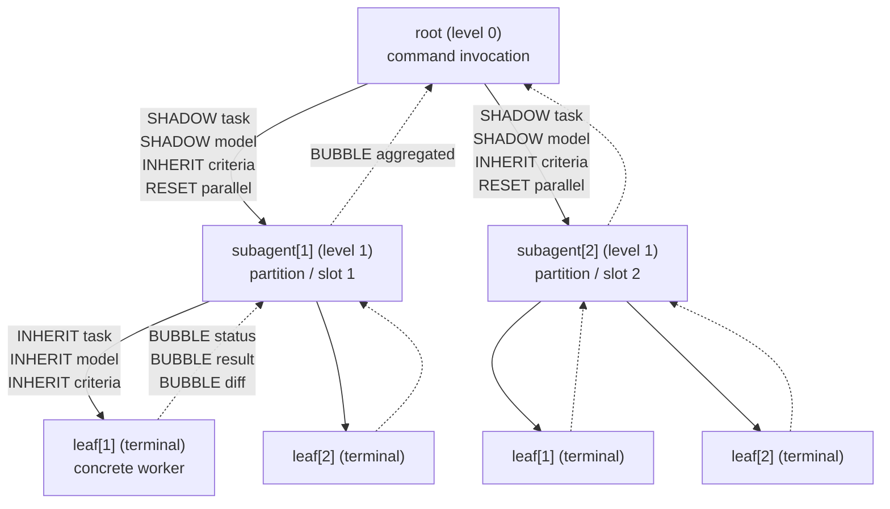

# Parameters: Tree-Shaped Ontology

> **Angle:** parameters as a **tree of scopes**. Root scope is the command invocation; child scopes are subagents (which may themselves have children); leaves are terminal workers. The same parameter name can re-bind in a child scope with different semantics, and resolution follows explicit tree rules (INHERIT, SHADOW, RESET, BUBBLE).

This directory is a reusable parameter ontology for both **commands** (under `ai-coding/plugins/ai-coding/commands/`) and **skills** (under `ai-coding/plugins/ai-coding/skills/`). Every command file declares a tree shape; every skill file declares which scopes it applies at. The ontology lets command authors talk about "this parameter at *this* scope" precisely without inventing per-command terminology.

---

## Motivation

The repo's commands fall into a small set of orchestration patterns:

| Command | Shape | Fan-out | Children's role |
|---|---|---|---|
| `meta-prompt.md` | flat | 1 | (no children) |
| `critique.md` | depth-1 fan-out | `num_experiments` independent runs | each run produces findings; root reduces |
| `worktree-task-agent.md` | depth-1 fan-out (or depth-2 partition) | `parallelism` worktrees, optionally grouped into `num_partitions` | each worktree is an isolated coder; root picks ≤1 to merge |

Every fan-out command shares the same *kind* of parameters but binds them at different "levels":

- some parameters live only at the orchestrator (root): `parallelism`, `num_partitions`, `selection_mode`, `merge_mode`.
- some parameters mean different things to root vs each child: `task` ("the user's intent" vs "this slot's slice"), `model` (orchestrator's model vs child's model), `worktree_name` (base slug vs `slug-{i}`), `save_path` (final destination vs in-worktree path).
- some parameters are produced by leaves and read upward: `status`, `result`, `diff`, `verification`, `findings`.

A **flat shared dictionary** would conflate all of these (one `model` parameter, one `task` parameter), forcing each command to invent its own re-binding rules. A **two-namespace** ontology would separate "command" parameters from "skill" parameters but still couldn't represent multi-depth fan-out cleanly. The tree-shaped angle directly models the fan-out and gives every parameter an explicit propagation policy.

The cost: commands that aren't tree-shaped (notably `meta-prompt.md` in its current form) pay an "always root scope" tax. We address that by giving the flat shape a name (Shape 0 in `tree-shapes.md`) and treating the absence of fan-out parameters as a valid root-only binding.

---

## Canonical tree



Solid arrows are **downward** propagation (INHERIT / SHADOW / RESET); dashed arrows are **upward** propagation (BUBBLE).

ASCII fallback for readers without Mermaid:

```
                          root
                          / \
                         /   \
                  SHADOW/     \SHADOW
                       /       \
                      v         v
              subagent[1]    subagent[2]
                / \              / \
        INHERIT v   v INHERIT   v   v
              leaf  leaf       leaf  leaf
                \   /            \   /
          BUBBLE \ /  BUBBLE      \ / BUBBLE
                  v                v
              subagent[1]      subagent[2]
                       \         /
                  BUBBLE \      / BUBBLE
                          \    /
                           v  v
                           root
```

---

## Files in this directory

| File | Lines | Purpose |
|---|---|---|
| `README.md` | 297 (this file) | Index, motivation, canonical tree, ≥2 worked command examples, top-level rules |
| `0-root.md` | 488 | Root scope — command-level orchestration parameters (52 parameter sections across families A–K) |
| `1-subagent.md` | 314 | Subagent scope — intermediate child node parameters (5 originating + 25 re-bound, grouped into 30 sections) |
| `2-leaf.md` | 294 | Leaf scope — terminal worker parameters + bubbled outputs (29 sections covering 4 originating, 18 inputs, 11 bubbled) |
| `inheritance.md` | 424 | The four propagation rules (INHERIT, SHADOW, RESET, BUBBLE), `int_range` and `file_type` formalisms, resolution algorithm, two end-to-end worked examples |
| `tree-shapes.md` | 275 | Catalogue of seven canonical tree topologies (flat, fan-out, partition fan-out balanced/ragged, recursive, serial pipeline, heterogeneous, empty) with validation per shape |

---

## Top-level resolution rules

Every parameter in every scope follows one of four rules. The full rule set is in `inheritance.md`; the summary:

| Rule | Direction | Default for |
|---|---|---|
| **INHERIT** | down | `criteria`, `guardrails` (additive), `stop_condition`, `test_command`, `model`, `temperature`, `verbosity`, `timeout`, `format`, `file_type`, `isolation`, `worktree_root`, `cleanup_policy`, `delete_worktree`, `base_branch` (non-recursive case) |
| **SHADOW** | down | `task`, `input`, `save_path`, `model` (when resolved from list-valued `agent_model`), `seed`, `focus_hint`, `worktree_name`, `subagent_type`, `subagent_model`, `subagent_prompt`, `output_format` |
| **RESET** | down | `fan_out`, `parallel`, `num_partitions`, `k`, `n_candidates`, `num_experiments`, `subagent_*`, `selection_mode`, `min_successes`, `ranker`, `aggregator`, `compare_against`, `merge_count`, `merge_mode`, `retry_policy`, `hang_policy`, `auto_save_winner` |
| **BUBBLE** | up | `status`, `result`, `diff`, `verification`, `change_summary`, `terminal_log`, `exit_code`, `elapsed_ms`, `attempts_made`, `findings`, `error`, `merge_recommendation` |

Look-up rule when in doubt: ask "does this parameter make sense at child scope?" — same value → INHERIT; derived value → SHADOW; child decides itself → RESET; it's the child's *output* → BUBBLE.

---

## Worked example 1: `critique.md`

`critique.md` runs `num_experiments` independent analysis runs of the same `context` against the same `criteria`, then aggregates findings. It is a **depth-1 fan-out** (Shape 1 in `tree-shapes.md`).

### Tree

```
root (model=claude-opus, num_experiments=3, parallel=2,
      criteria="quality+determinism", context=src/auth.ts)
 ├── leaf[1]   (slot=1, run #1)
 ├── leaf[2]   (slot=2, run #2)
 └── leaf[3]   (slot=3, run #3)
```

### Parameter resolution

| Param | `root` value | `leaf[1]` value | Rule applied |
|---|---|---|---|
| `task` | "analyze {context} against {criteria}" | "analyze src/auth.ts against quality+determinism (run 1/3)" | SHADOW (slot annotated) |
| `context` | `{file: "src/auth.ts"}` | `{file: "src/auth.ts"}` | INHERIT |
| `criteria` | `quality + determinism` | `quality + determinism` | INHERIT |
| `model` | `claude-opus` | `claude-opus` (no `agent_model` set, so INHERIT from `model`) | INHERIT |
| `num_experiments` | `3` | n/a (RESET — leaf does not re-fan-out) | RESET |
| `parallel` | `2` | n/a (RESET) | RESET |
| `selection_mode` | `synthesize` (default for critique) | n/a (only root selects) | not propagated |
| `aggregator` | `merge-findings` | n/a | not propagated |
| `findings` | (aggregated bubbled list) | per-run list of `{location, criterion, severity, evidence, rationale}` | BUBBLE |
| `status` | (aggregated) | `success` / `failed` / `incomplete` | BUBBLE |

### Reduction at root

Root applies `selection_mode = synthesize` with `aggregator = merge-findings`:

1. Collect `root.children_findings = [leaf[1].findings, leaf[2].findings, leaf[3].findings]`.
2. Group by `(location, criterion)`.
3. Tag groups with size ≥ 2 as **convergent**; size 1 as **divergent**.
4. Render the report per `critique.md`'s output format (`## Findings` for convergent + critical/major/minor/nit, `## Divergent Findings` for divergent).

This matches the existing `critique.md` semantics exactly without inventing new vocabulary.

### Validation (before any leaf is spawned)

- `int_range`: `num_experiments = 3 >= 1` ✓, `parallel = 2 >= 1` ✓, `parallel <= num_experiments` ✓, `depth = 1 >= 0` ✓.
- `file_type`: not constrained → all extensions accepted.
- List-shape: `agent_model` not set → no list-shape check needed.

---

## Worked example 2: `worktree-task-agent.md` with partitions

`worktree-task-agent.md` runs `parallelism` agents in isolated worktrees on the same `task`, optionally grouped into `num_partitions` partitions. With `num_partitions > 1` it is a **depth-2 partition fan-out** (Shape 2). With `num_partitions = 1` it is a **depth-1 fan-out** (Shape 1).

### Invocation

```
/worktree-task-agent
  task: "implement OAuth login and verify"
  parallelism: 4
  num_partitions: 2
  agent_model: ["claude-opus-4", "claude-sonnet-4", "claude-opus-4", "gpt-5"]
  base_branch: "main"
  worktree_name: "oauth-login"
  test_command: "pytest tests/auth/"
  merge_mode: "interactive"
```

### Tree

```
root  (parallelism=4, num_partitions=2, fan_out=4, depth=2)
├── subagent[1]  (partition=1, slot=1)
│   ├── leaf[1]  (slot=1, model=agent_model[1]=claude-opus-4,
│   │              worktree_path=.../oauth-login-1, branch=oauth-login-1)
│   └── leaf[2]  (slot=2, model=agent_model[2]=claude-sonnet-4,
│                  worktree_path=.../oauth-login-2, branch=oauth-login-2)
└── subagent[2]  (partition=2, slot=2)
    ├── leaf[1]  (slot=1, model=agent_model[3]=claude-opus-4,
    │              worktree_path=.../oauth-login-3, branch=oauth-login-3)
    └── leaf[2]  (slot=2, model=agent_model[4]=gpt-5,
                   worktree_path=.../oauth-login-4, branch=oauth-login-4)
```

(The slot numbering inside each subagent restarts at 1; the global "i-th worktree" mapping uses partition × leaf-slot or a flat 1-based index across the whole `parallelism`. `worktree-task-agent.md`'s existing `-{i}` suffix follows the flat indexing.)

### Parameter resolution

| Param | `root` | `subagent[1]` | `subagent[1].leaf[1]` | Rule applied |
|---|---|---|---|---|
| `task` | "implement OAuth..." | "implement OAuth (partition 1)" | "implement OAuth (partition 1, slot 1)" | SHADOW |
| `parallelism` | 4 | 1 (RESET — subagent does not further fan-out beyond its 2 leaves; the 2 leaves come from `subagent.fan_out = 2`, not `parallelism`) | n/a | RESET |
| `num_partitions` | 2 | 1 (RESET) | n/a | RESET |
| `fan_out` | 4 | 2 (= `parallelism / num_partitions`; subagent re-binds) | n/a | RESET |
| `agent_model` | `[claude-opus-4, claude-sonnet-4, claude-opus-4, gpt-5]` | (RESET; subagent has its own list of length 2) | n/a | RESET |
| `model` | claude-opus-4 (orchestrator's model) | claude-opus-4 | claude-opus-4 (= `agent_model[1]`) | SHADOW (zip) |
| `base_branch` | "main" | "main" | "main" | INHERIT |
| `worktree_name` | "oauth-login" | "oauth-login-1" | "oauth-login-1" | SHADOW (suffix) |
| `worktree_path` | n/a | originates: `~/.cursor/worktrees/.../oauth-login-1` | INHERIT | originates / INHERIT |
| `branch` | n/a | "oauth-login-1" | INHERITED | originates / INHERIT |
| `test_command` | "pytest tests/auth/" | "pytest tests/auth/" | "pytest tests/auth/" | INHERIT |
| `merge_mode` | "interactive" | n/a (only root merges) | n/a | not propagated |
| `criteria` | unset (default) | unset (INHERIT) | unset (INHERIT) | INHERIT |
| `status` | aggregated | aggregated from this subagent's leaves | "success" / "failed" / etc. | BUBBLE |
| `verification` | aggregated | aggregated | `{exit_code: 0, ...}` | BUBBLE |
| `diff` | per-leaf collected | per-partition collected | unified diff at this leaf | BUBBLE |
| `merge_recommendation` | one branch overall (or none) | per partition | per leaf | BUBBLE → reduce |

### Reduction

1. **At each subagent (per partition):** collect leaves' bubbled values; report partition-level summary upward.
2. **At root:** collect per-partition (or per-leaf, since merge_mode is `interactive`) bubbled values; produce the per-worktree report block per `worktree-task-agent.md`'s output format.
3. **At root, merge step:** ask the user (because `merge_mode = interactive`) which branch to merge into `main`; merge ≤ 1 branch (per existing guardrail); delete merged worktree per `delete_worktree = true`.

### Validation (before any worktree is created)

- `int_range`: `parallelism = 4 >= 1` ✓, `num_partitions = 2 >= 1` ✓, `4 % 2 == 0` ✓ (clean partition division).
- List-shape: `len(agent_model) = 4 == parallelism` ✓ (full iteration).
- `depth = 2`: subagents may spawn (depth = 1 at subagent), leaves cannot spawn (depth = 0 at leaf) ✓.

If `agent_model = ["a", "b"]` had been provided instead, validation would check whether `len = 2` is a valid partition slice (one model per partition broadcast within = 2 ✓), and the resolution at `leaf[1].model` would broadcast within partition: `subagent[1].model = "a"`, `subagent[2].model = "b"`, every leaf inside `subagent[i]` shadows that scalar.

---

## How a command file consumes this ontology

A command file declares its tree shape and the parameter bindings at each scope. Suggested header:

```markdown
## Parameter Tree
- **Shape:** depth-1 fan-out (see `ai-coding/parameters/tree-shapes.md#shape-1-fan-out-depth-1`).
- **Root scope:** binds `{task}`, `{context}`, `{criteria}`, `{model}`, `{num_experiments}`, `{parallel}`. (See `ai-coding/parameters/0-root.md`.)
- **Leaf scope:** SHADOWS `task` (slot-annotated); INHERITS `context`, `criteria`, `model`; BUBBLES `findings`, `status`. (See `ai-coding/parameters/2-leaf.md`.)
- **Reduction:** root applies `selection_mode = synthesize` with `aggregator = merge-findings`.
```

The command's existing `## Parameters` section can then drop redundant prose ("…sequential when…") in favor of pointing at the per-scope file. Minimal, surgical migration: add the Parameter Tree block; leave the rest unchanged.

---

## How a skill consumes this ontology

A skill (e.g. `minimal-diffs/SKILL.md`, `conventional-commits/SKILL.md`) declares which scopes it activates at:

```markdown
## Activates at scope
- `leaf` (always): every leaf making file edits applies these rules.
- `subagent` (when committing): a subagent that commits per-stage applies the conventional commit format.
```

This makes it explicit that, e.g., `minimal-diffs` is a leaf-scope concern (the leaf is the scope that *makes* the edits) — even though the skill itself never spawns children.

---

## Self-check: what this ontology buys

- **Single source of truth for fan-out.** `parallel`, `num_partitions`, `fan_out`, `k`, `num_experiments` are documented in one place (`0-root.md`) with one set of resolution rules (`inheritance.md`).
- **Multi-depth is native.** A future `/refine-best-of-n` that nests `meta-prompt` inside `worktree-task-agent` doesn't need new vocabulary — it's a depth-2 (or depth-3) tree using the same scopes.
- **Bubbled outputs are explicit.** Every command's "what does the user finally see" is the result of root reducing bubbled values, and the bubbled values themselves are typed and named.
- **Validation has a fixed shape per topology.** `tree-shapes.md` lists the exact validation rules per shape; commands no longer roll their own validation prose.

## Trade-offs (vs. other angles)

The angle's costs are real and called out here:

- **Flat consumers pay a "root-only" tax.** `meta-prompt.md` is a Shape 0 / Shape 7 command. It still has to claim a tree shape; arguably overkill for "one model, one turn, one prompt" workflows. A flat shared dictionary (Angle 1) would be simpler for these cases.
- **Cross-cutting concerns are awkward.** Things like "always log every leaf's terminal" or "always set `temperature = 0`" are repeated at every scope rather than declared once. A concern-first ontology (Angle 5) would localize these as "Concern: logging" cross-cuts.
- **Redundancy across scope files.** The same parameter (`criteria`, `test_command`, `model`) appears in `0-root.md`, `1-subagent.md`, `2-leaf.md` with substantially overlapping text. We mitigate by referencing back to `0-root.md` for shared content, but the redundancy is real and is a maintenance burden.

(See the bottom of `tree-shapes.md` for the cheat sheet on when each shape is the right call.)

---

## Cross-references

| Topic | File |
|---|---|
| Root scope parameter list (50 params) | `0-root.md` |
| Subagent scope (5 originating + 36 re-bound) | `1-subagent.md` |
| Leaf scope (4 originating + 18 inputs + 11 bubbled) | `2-leaf.md` |
| INHERIT / SHADOW / RESET / BUBBLE rules + `int_range` / `file_type` formalisms | `inheritance.md` |
| 7 canonical tree shapes + per-shape validation | `tree-shapes.md` |
| Existing commands consuming this ontology | `ai-coding/plugins/ai-coding/commands/{critique,worktree-task-agent,meta-prompt,trajectory}.md` |
| Existing skills active at leaf scope | `ai-coding/plugins/ai-coding/skills/{minimal-diffs,conventional-commits}/SKILL.md` |
