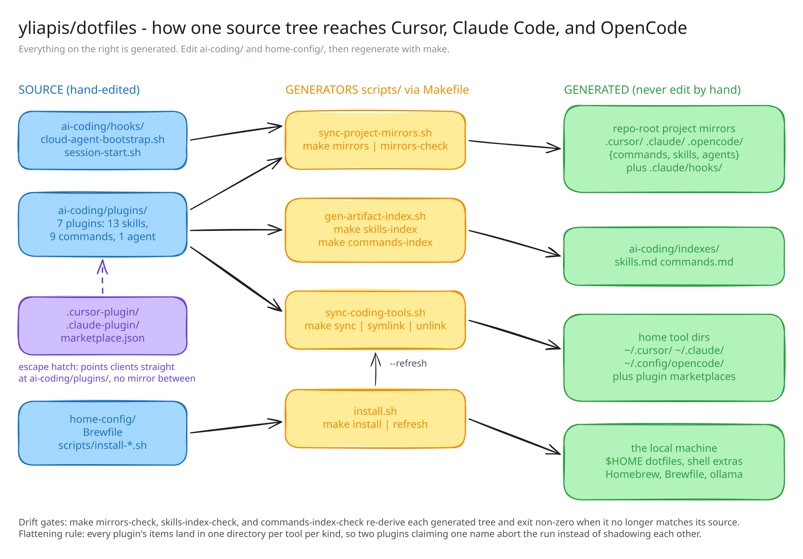
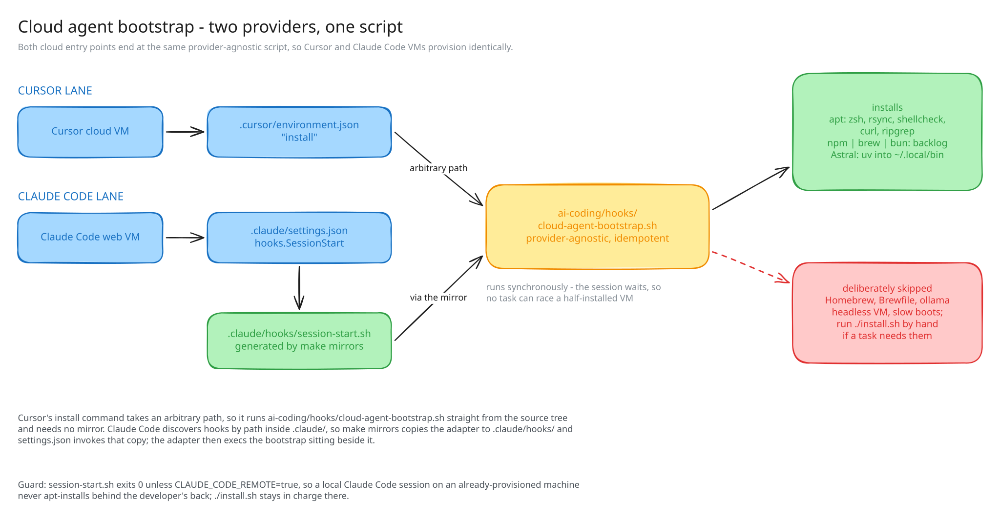

# Diagrams

Excalidraw diagrams of how this repository is wired, drawn with the
[`excalidraw-diagrams`](../../ai-coding/plugins/excalidraw/skills/excalidraw-diagrams)
skill.

Each diagram ships three files:

| Extension | Use |
|---|---|
| `.svg` | Embeddable render. Self-contained — Excalifont is inlined, so it needs no network to display. |
| `.excalidraw` | Editable scene. Open it on [excalidraw.com](https://excalidraw.com) or in the Excalidraw editor. |
| `.elements.json` | The MCP shorthand array the scene was authored from, and the input to a re-export. |

`.png` renders are not committed: the `.svg` is self-contained and renders
inline on GitHub, so the raster copies would only add weight. Regenerate one
locally when a raster is needed.

## repo-architecture

`ai-coding/` and `home-config/` are the only hand-edited trees; three scripts
under `scripts/` derive everything else, and the Makefile is the front door to
all of them.



## cloud-agent-bootstrap

Cursor and Claude Code reach the same `cloud-agent-bootstrap.sh` by different
routes — Cursor through an arbitrary path in `.cursor/environment.json`, Claude
Code through the `.claude/hooks/` mirror that `make mirrors` generates.



## Regenerating

These are hand-authored, not generated by a `make` target, so no drift check
covers them: a change to the scripts, the plugin counts, or the bootstrap flow
will not fail a build here. Update the diagram in the same change that moves
the thing it describes.

To re-export after editing an `.elements.json`:

```sh
node ~/.claude/skills/excalidraw-diagrams/scripts/export-scene.mjs \
  docs/diagrams/repo-architecture.elements.json \
  docs/diagrams/repo-architecture
```

That writes the `.svg`, `.excalidraw`, and `.png` together; keep the first two
and discard the `.png`. The exporter needs a Chrome/Chromium binary and network
access to esm.sh.
