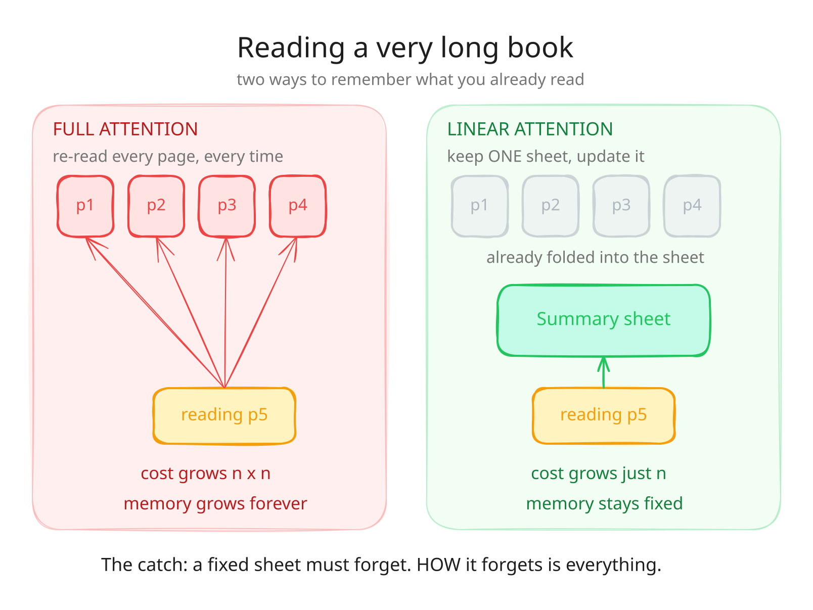
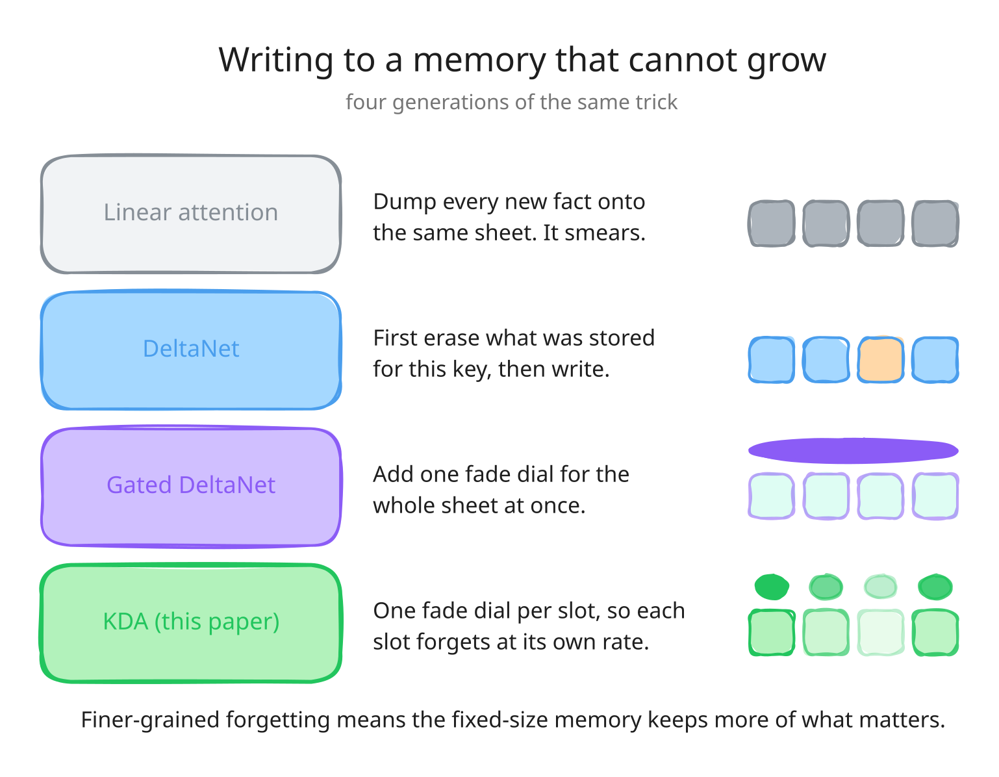
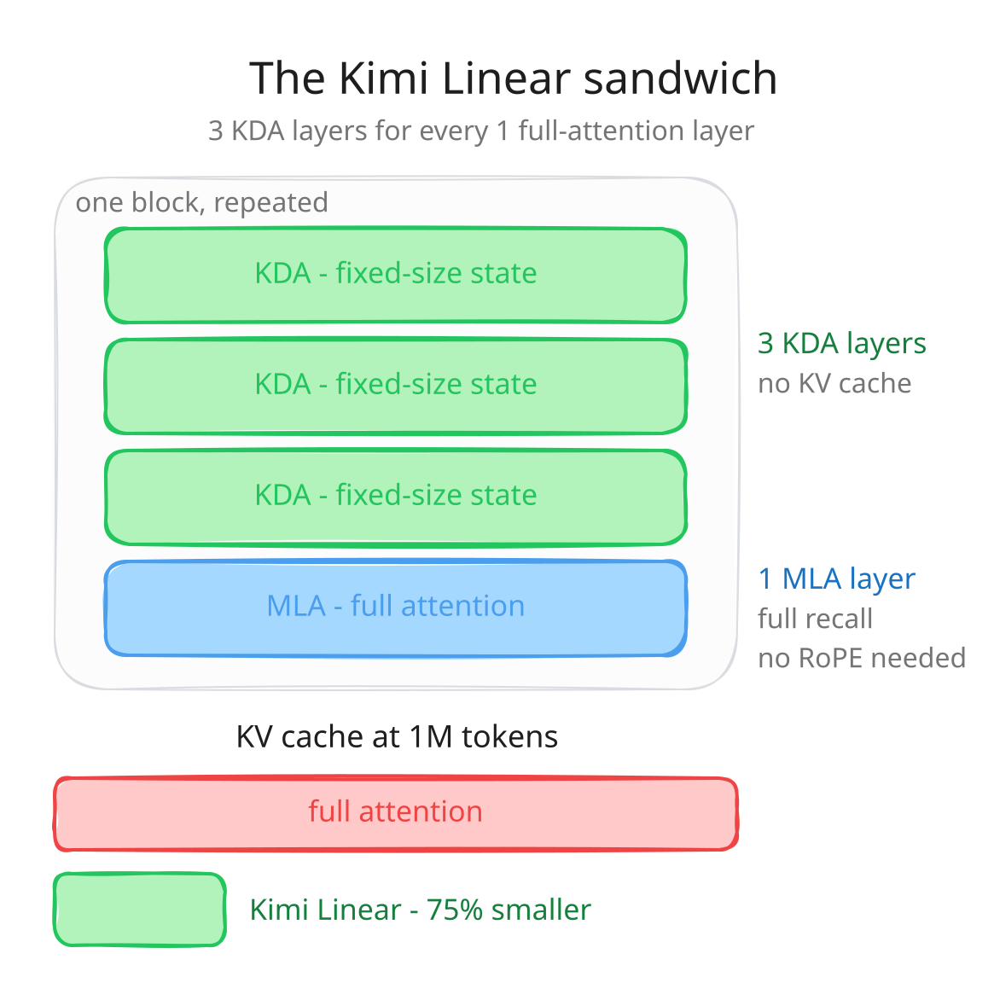
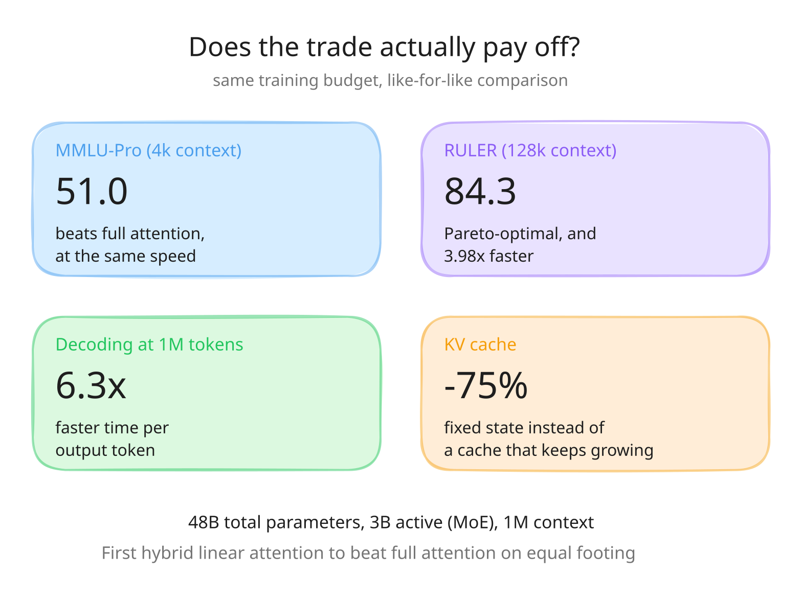

# Kimi Linear, explained simply

**Paper:** [Kimi Linear: An Expressive, Efficient Attention Architecture](https://arxiv.org/abs/2510.26692)
(arXiv:2510.26692) — Moonshot AI, October 2025.
**Code / weights:** [MoonshotAI/Kimi-Linear](https://github.com/MoonshotAI/Kimi-Linear) ·
[Kimi-Linear-48B-A3B-Instruct](https://huggingface.co/moonshotai/Kimi-Linear-48B-A3B-Instruct) ·
[KDA kernel in FLA](https://github.com/fla-org/flash-linear-attention/tree/main/fla/ops/kda)

## The one-sentence version

Attention is the part of an LLM that looks back over everything said so far. It is
accurate but expensive. Kimi Linear replaces three out of every four attention layers
with a cheap fixed-size memory that forgets more cleverly than earlier attempts — and
the result beats full attention outright, rather than merely running faster than it.

## 1. Why attention gets expensive

**Full attention** re-reads everything. For each new token it compares against every
previous token, so `n` tokens cost roughly `n × n` work, and every token's key/value
pair has to be kept around forever in the KV cache. At a million tokens that cache is
huge, and just streaming it out of memory is what makes generation slow.

**Linear attention** keeps one fixed-size summary instead. Each new token updates the
summary and is then thrown away. Cost per token is constant, memory is constant.

The catch is in that word *fixed*. A summary sheet that never grows has to overwrite
things. How it chooses what to overwrite is the entire problem.

## 2. Four generations of forgetting

- **Plain linear attention** adds each new key/value onto the state. Old and new
  content smear together, and nothing is ever really removed.
- **DeltaNet** applies the *delta rule*: before writing, subtract whatever the state
  currently returns for this key. It is the difference between updating a dictionary
  entry and stapling another sticky note on top of the old one.
- **Gated DeltaNet** adds a decay gate so stale content fades out — but the gate is a
  single scalar per head. The whole state fades at one rate.
- **Kimi Delta Attention (KDA)**, this paper's contribution, gives every channel its
  own decay rate. Some dimensions can hold onto "who is the subject of this document"
  across the whole context while others reset every sentence.

Why that matters: the state is a fixed budget. One shared fade rate forces a single
compromise across all of it. Per-channel rates let the model spend the budget where it
actually pays off, which is the paper's "more effective use of limited finite-state RNN
memory."

The cost of the finer gate is that it makes the state-transition matrix richer, which
normally breaks the chunked form that keeps these models fast. KDA uses a restricted
Diagonal-Plus-Low-Rank (DPLR) structure with a bespoke chunkwise algorithm, so the
recurrence still collapses into big matrix multiplies that saturate tensor cores. That
is the "hardware-aware" half of the contribution, and it is why the finer gating is
close to free.

## 3. The architecture

Kimi Linear is a hybrid, not a pure linear model. The repeating block is **three KDA
layers to one MLA layer** (Multi-head Latent Attention — full attention with a
compressed KV cache). The 3:1 ratio was chosen empirically: it gave the lowest training
*and* validation loss. Pushing further toward KDA kept training loss similar but hurt
validation; going the other way matched validation loss while costing more at inference.

Two consequences fall out of that layout:

- **KV cache shrinks by up to 75%**, because only one layer in four keeps one at all.
  The KDA layers carry a fixed-size state regardless of context length.
- **The global layers use no positional encoding at all (NoPE).** KDA's per-channel
  decay already encodes recency and order, so the full-attention layers do not need
  RoPE. A pleasant side effect: no RoPE base-frequency retuning when stretching the
  context window.

## 4. Does the trade pay off?

Under matched training budgets (1.4T tokens, same data, same recipe), Kimi Linear beats
both a full-attention MLA baseline and a Gated DeltaNet hybrid — at short context, at
long context, and in RL-style post-training. The released checkpoints are 48B total /
3B activated parameters (MoE) with a 1M context, trained on 5.7T tokens.

## Caveats worth keeping in mind

- "Beats full attention" holds at *this* scale and *this* training budget. It is strong
  evidence, not a proof that the ordering survives at frontier scale.
- The 6.3× figure is decoding throughput at 1M context. At short context the speed is
  roughly par with full attention — the win there is quality, not speed.
- It is still a hybrid. Those one-in-four full-attention layers are doing real work;
  pure linear attention has not caught up.

## About these diagrams

Drawn with the [`excalidraw-diagrams`](../../../.claude/skills/excalidraw-diagrams)
skill. Each `.svg` has a matching `.excalidraw` scene next to it in `diagrams/` — open
those on [excalidraw.com](https://excalidraw.com) to edit.
